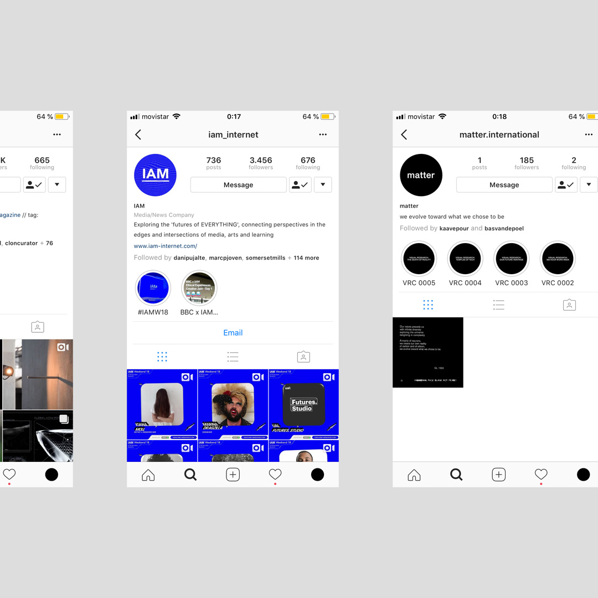
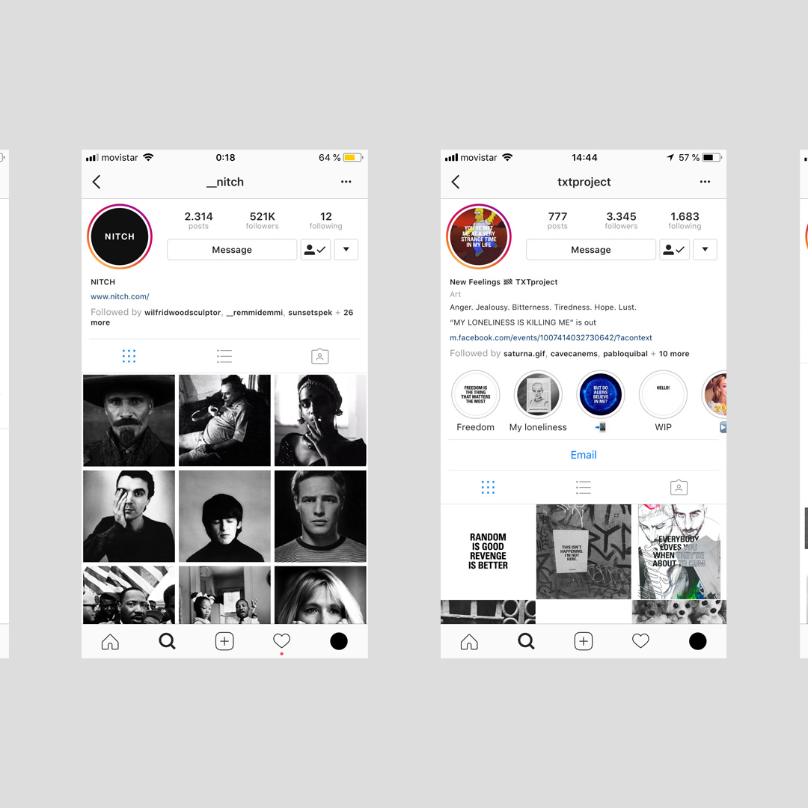
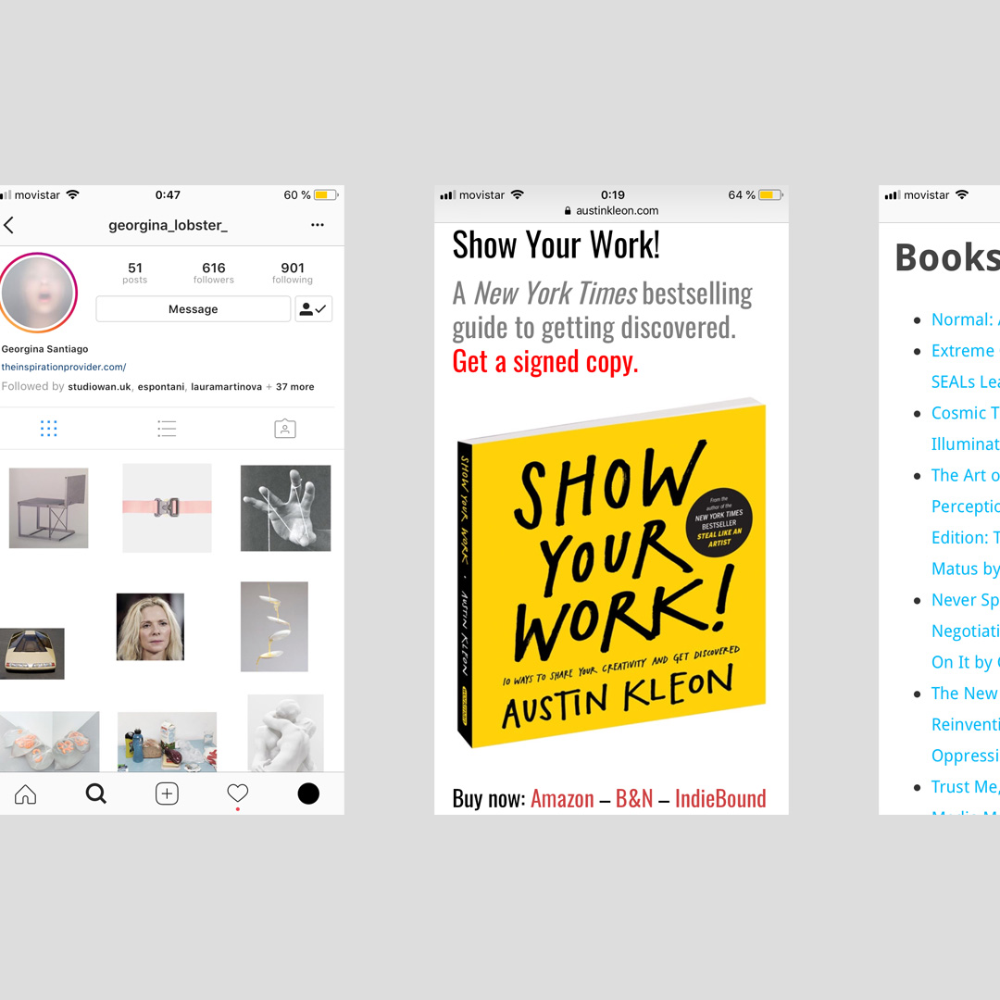
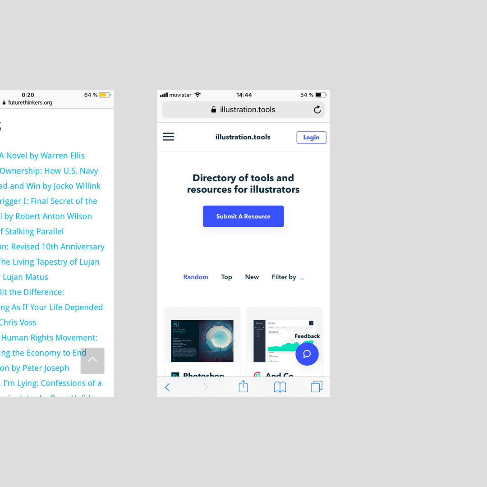

    

        
        
        
        
        
    

>[Posted](202106221357) on May 22, 2018

Hi there! I’m gonna try a new relationship with Instagram.⁣⁣

I would like to experiment a formula that helps me to put some order inside my head and at the same time it gives me the opportunity to trigger conversations and create new connections. The idea is to open the spectrum of content I used to share and expose more my persona, in an organized way.⁣⁣

One of the main type of content I wanna share with you are my sources of inspiration. So I’m gonna start with a collection of references I kept present in my mind while developing this new phase. Here you’ll find some aesthetic references, and ideas I took for the content, structure and strategy.⁣

@amc_can (designed by @esthermiquel ) @creativeappsnet @iam_internet @matter.international @__nitch @txtproject @georgina_lobster_ and the resources page from @futurethinkers site. The book by @austinkleon helped me to land some thoughts and the work that @magoz is doing with his new platform called illustration.tools as one great example of how to manage and nourish a creative community.

Because IG doesn’t allow to put links here and for me is something essential to accredit well, I built a directory in my website to gather all the links. The little number at the bottom left of the picture is there for that. You’ll find the link in my bio.

❤️

#daa_inspiration⁣⁣  
#daa_research⁣⁣  
#daa_1
