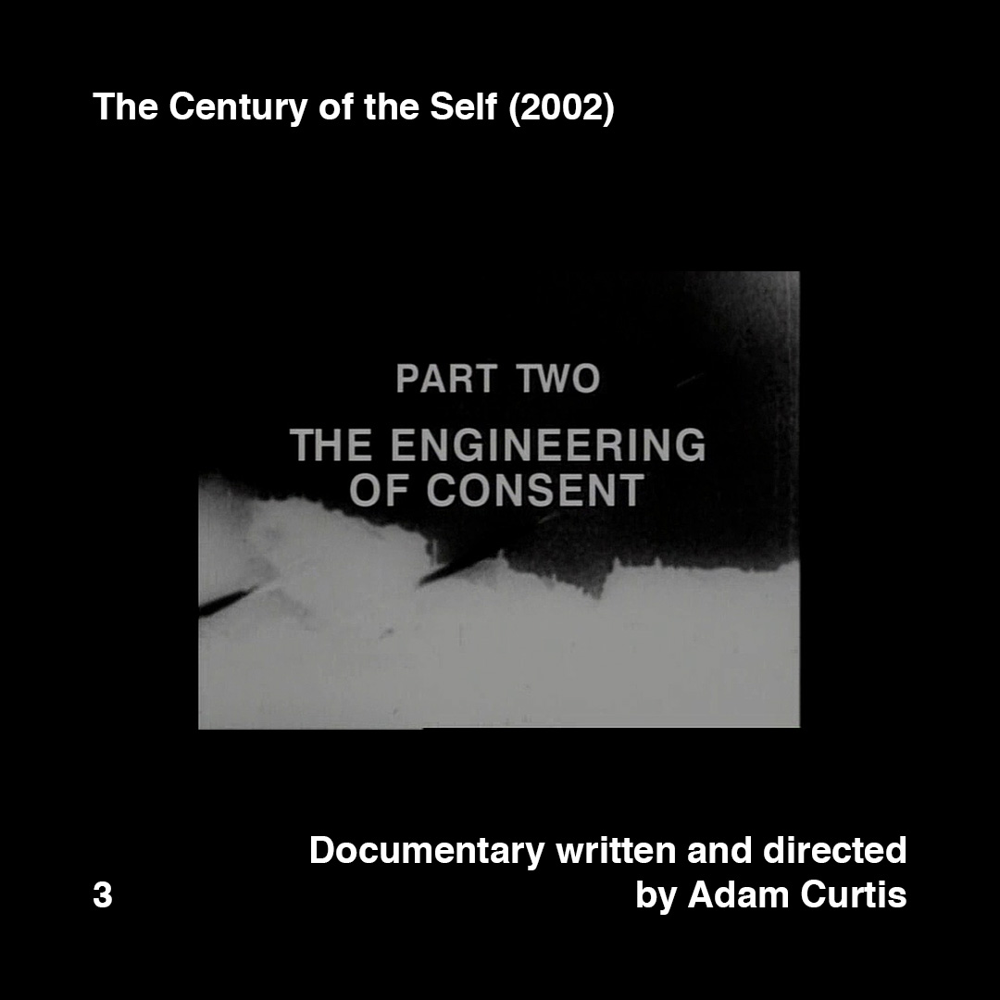
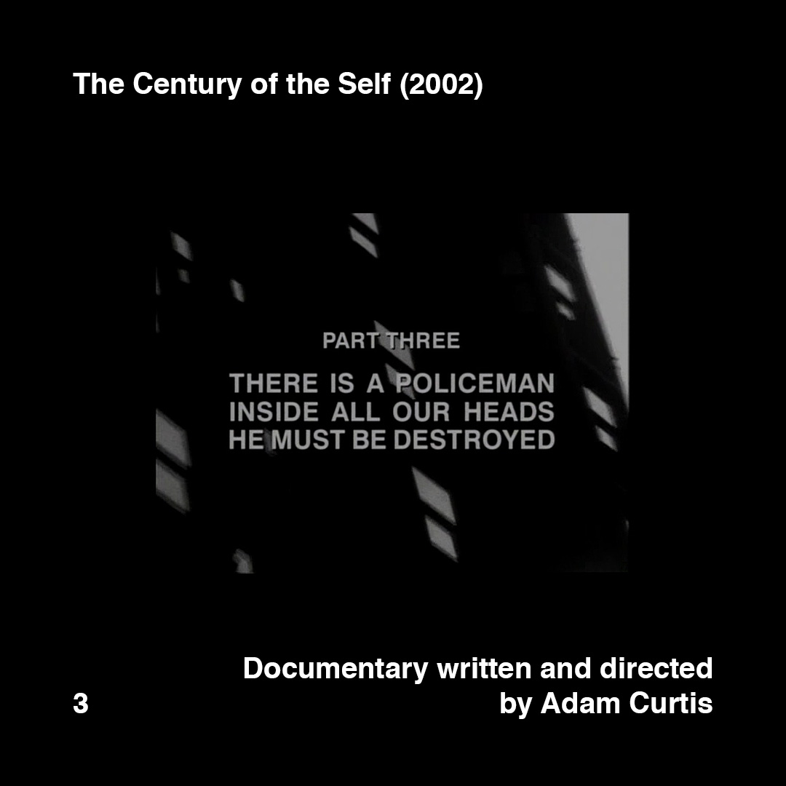
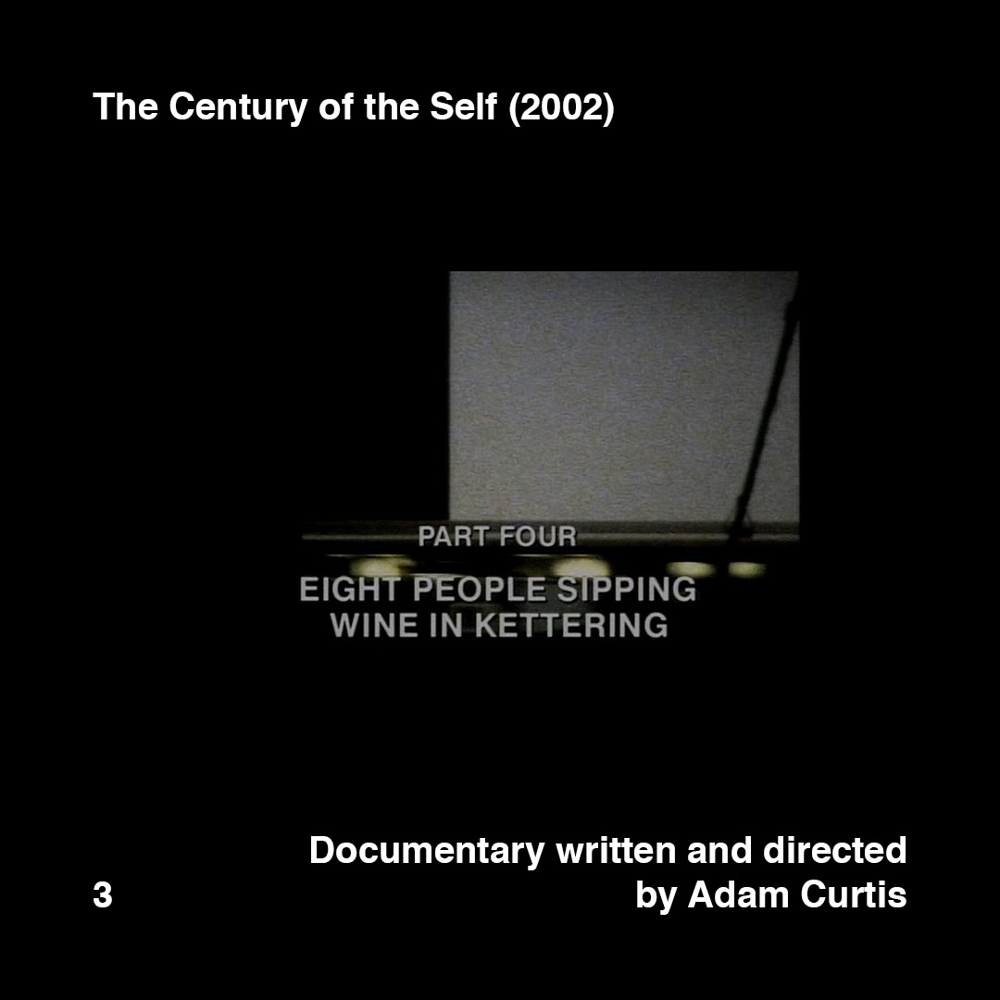

    

        
        
        
        
    

>[Posted](202106221357) on May 23, 2018

>The Century of the Self (2002)  
>Documentary written and directed by Adam Curtis

Recommended a lot this documentary, especially at the students I had been the pleasure to teach and tutor during the past 2 years.

Four-hour documentary divided in four parts, intended for all publics and backgrounds.

For me it was an eye-opening experience as it gave me a better understanding of the hidden intentions and mechanisms behind advertising, at least when it was born, under the name of public relations, working hand-in-hand with consumerism and politics.

#daa_inspiration_to_watch  
#daa_documentary  
#daa_3