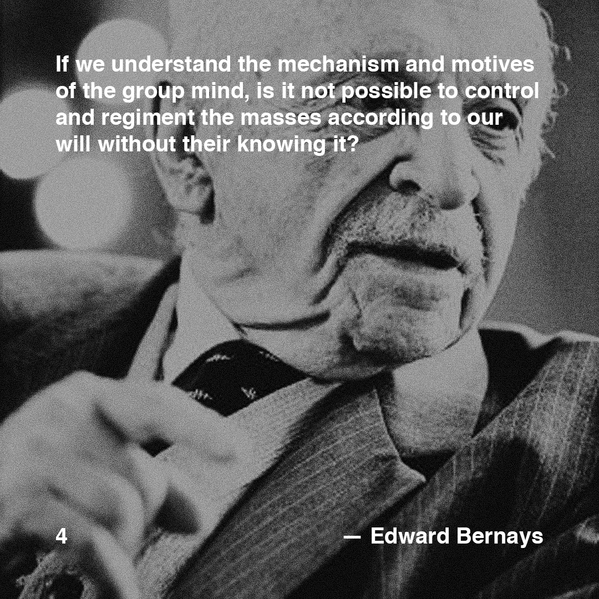

>[Posted]([[202106221357]]) on May 23, 2018

>"If we understand the mechanism and motives of the group mind, is it not possible to control and regiment the masses according to our will without their knowing it?"  
>*— Edward Bernays*

And this is what exactly happened.

Edward Bernays, pioneer in the field of public relations (aka advertising) and propaganda.

Watch the documentary [#daa_3]([[201805231412]]) if you wanna know more about him and the context of the quote ;-)

#daa_inspiration_to_read  
#daa_quote  
#daa_4  