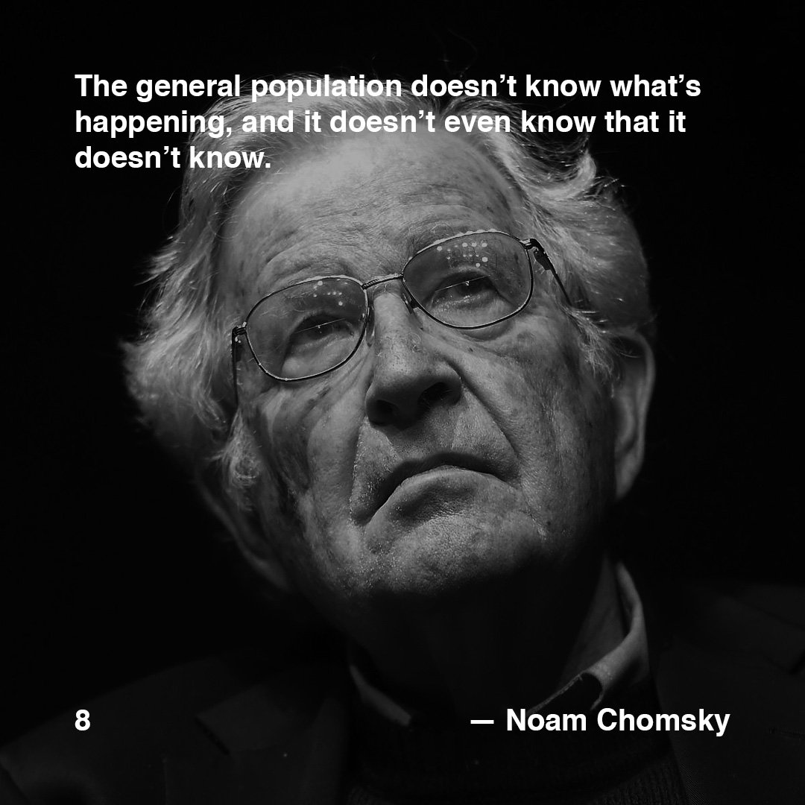

>[Posted](202106221357) on May 26, 2018

>"The general population doesn’t know what’s happening, and it doesn’t even know that it doesn’t know."  
>*— Noam Chomsky*

If you don’t know him, I recommend you to watch the documentary “Requiem for the American Dream” (2015) — 1h 13min, where he describes the systems that have led to financial inequality, and the current concentration of wealth and power.

Related to [#daa_3](201805231412)

#daa_inspiration_to_read  
#daa_quote  
#daa_8