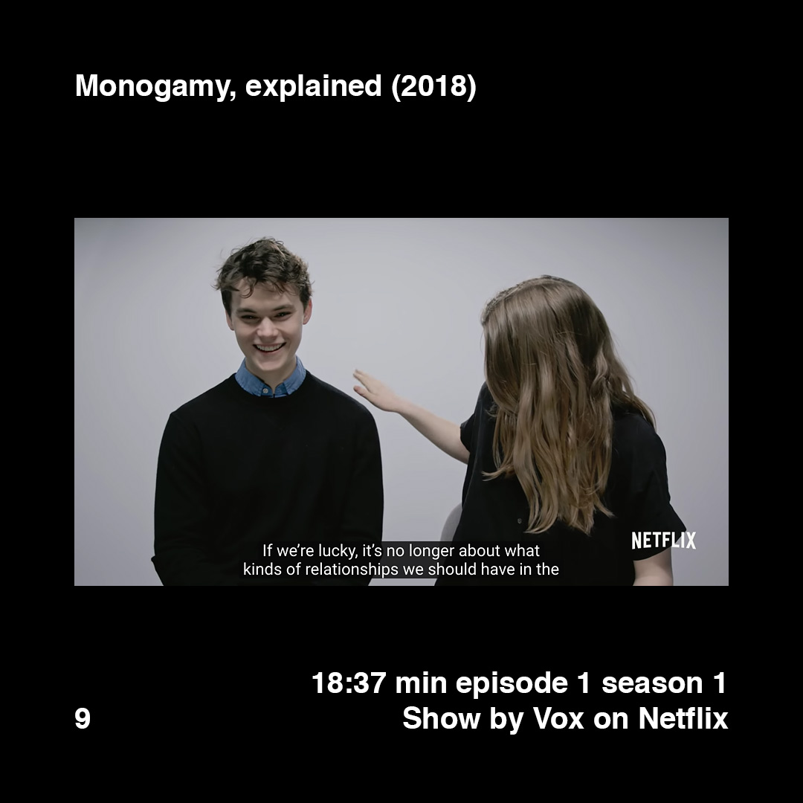
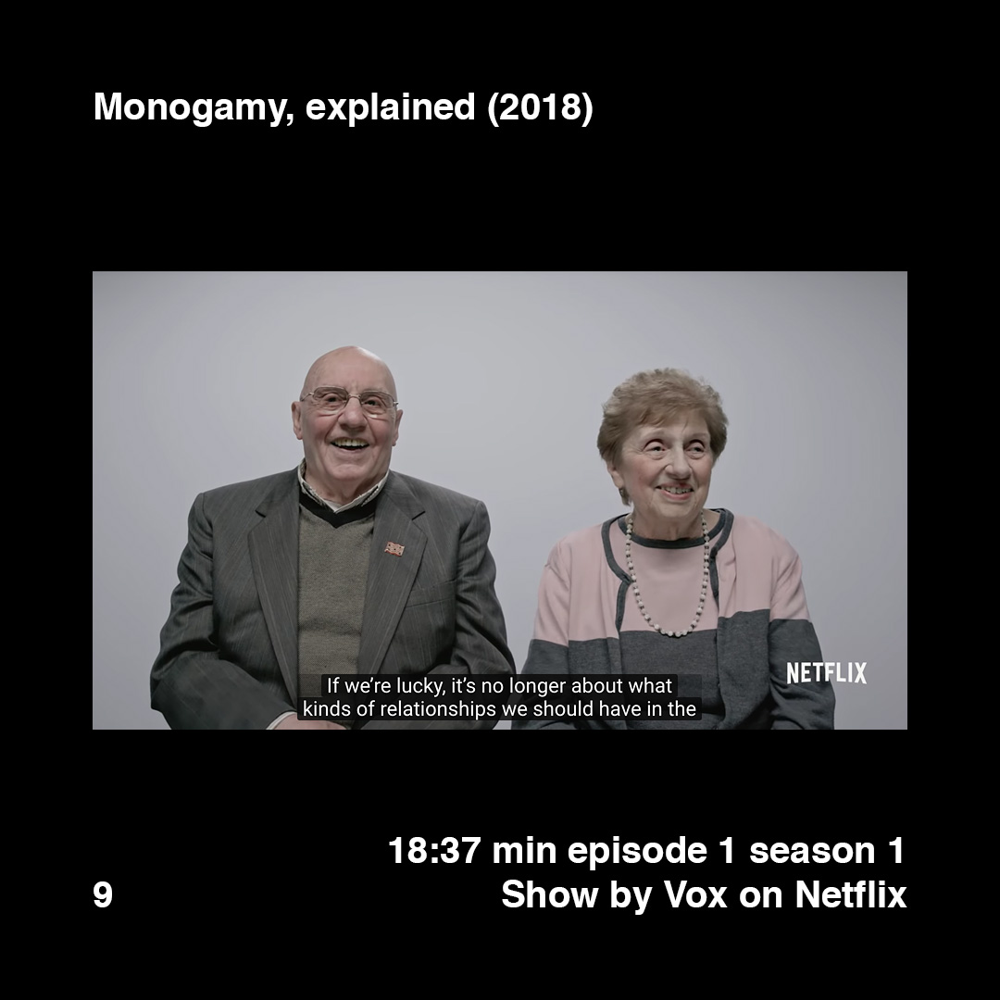
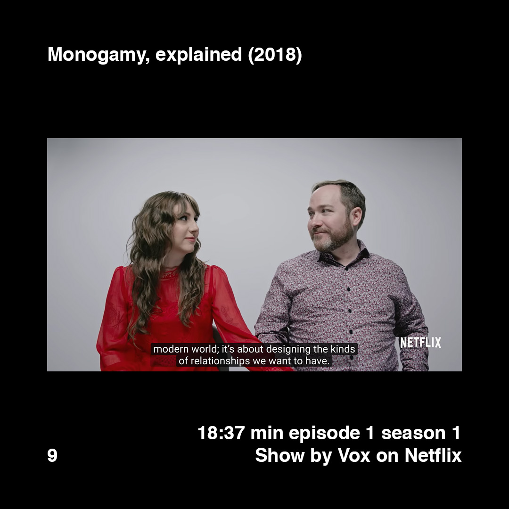
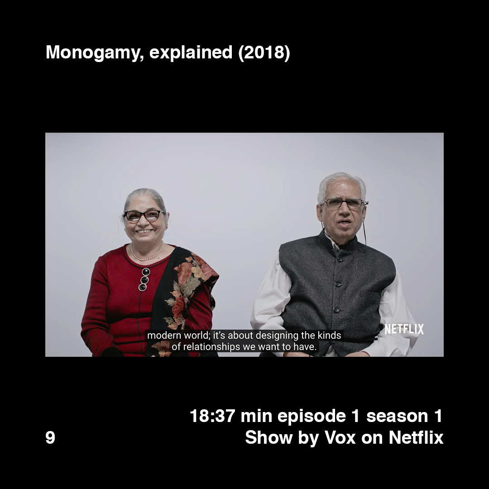
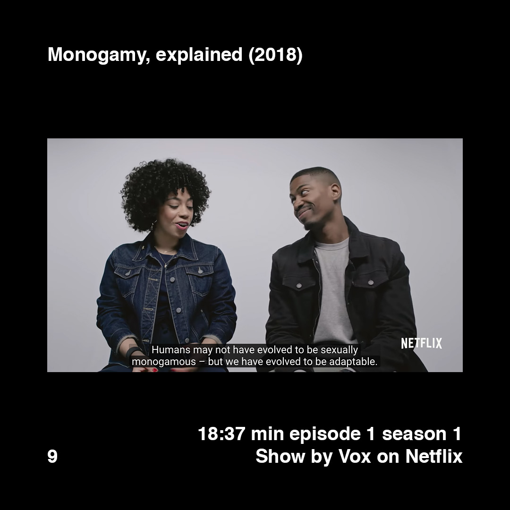
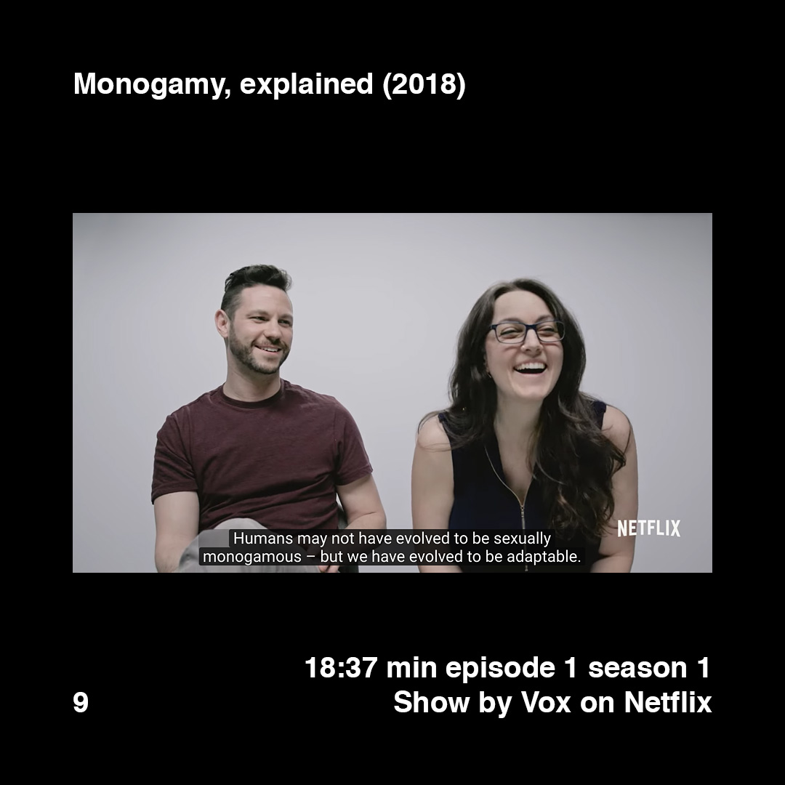
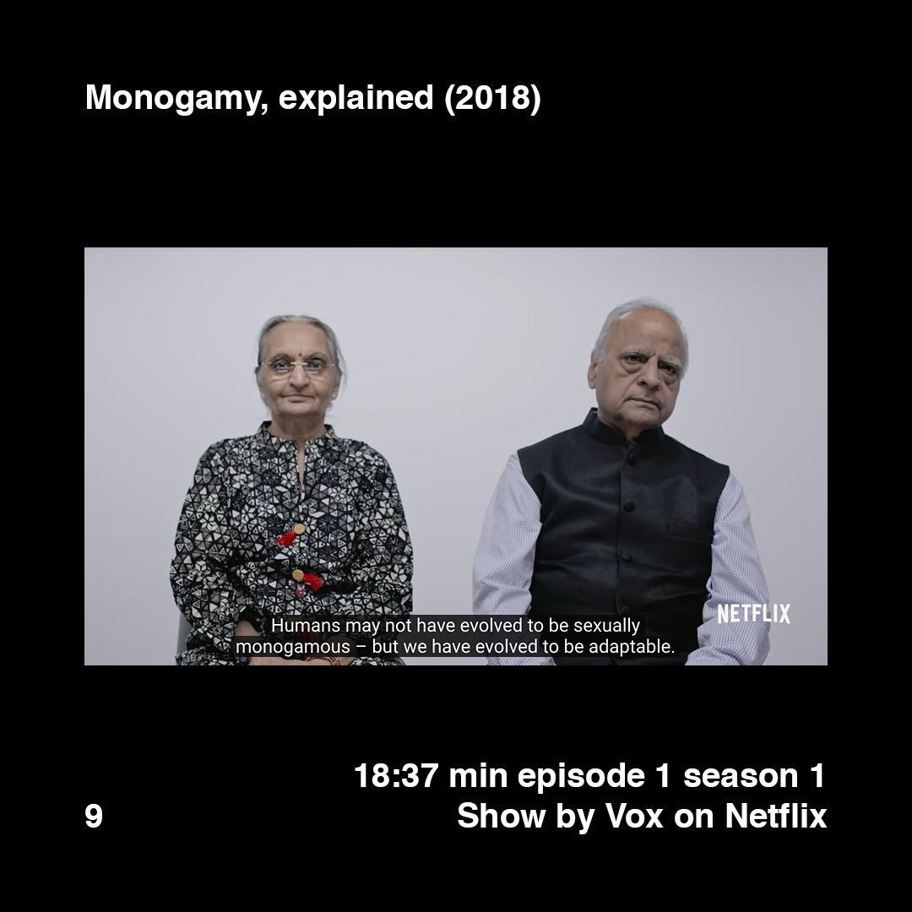

    

        
        
        
        
        
    

    

        
        
        
        
        
    

>[Posted](202106221357) on May 27, 2018

>Monogamy, explained (2018)  
>18:37 min episode 1 season 1  
>Show by Vox on Netflix  

This is the best video explaining the concept of monogamy I found so far. Complete, well documented, inclusive and respectful.

If you are interested in the topic and have other points of view, I would love to listen them.

Because this is the first video between Vox and Netflix, it is online in Youtube also, for free. Link in the bio.

—

Text copied from the description of the video in Youtube:

“In 2016, more than 2.2 million couples got married in America, but more than 800,000 got divorced. Cheating and breakups cause grief and heartache every day. Yet some historians and evolutionary biologists say monogamy is a relatively new, self-imposed system. Their evidence suggests humans lived without it for more than 250,000 years. And we only started marrying for love in the 1700s.

So if monogamy is so hard, why do most of us, all around the world, make it a central goal of our lives?”

#daa_inspiration_to_watch  
#daa_documentary  
#daa_9