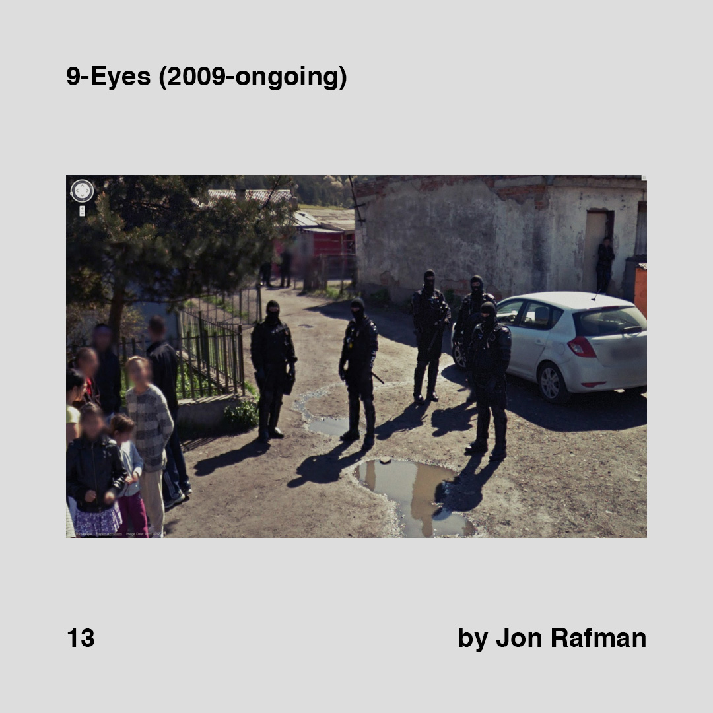
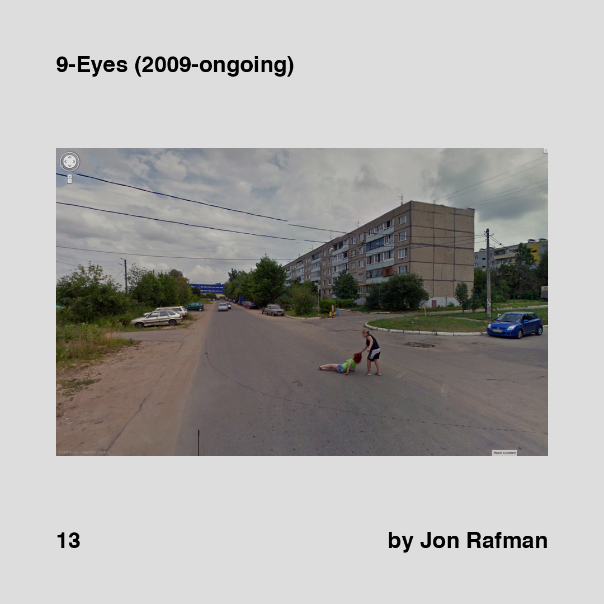
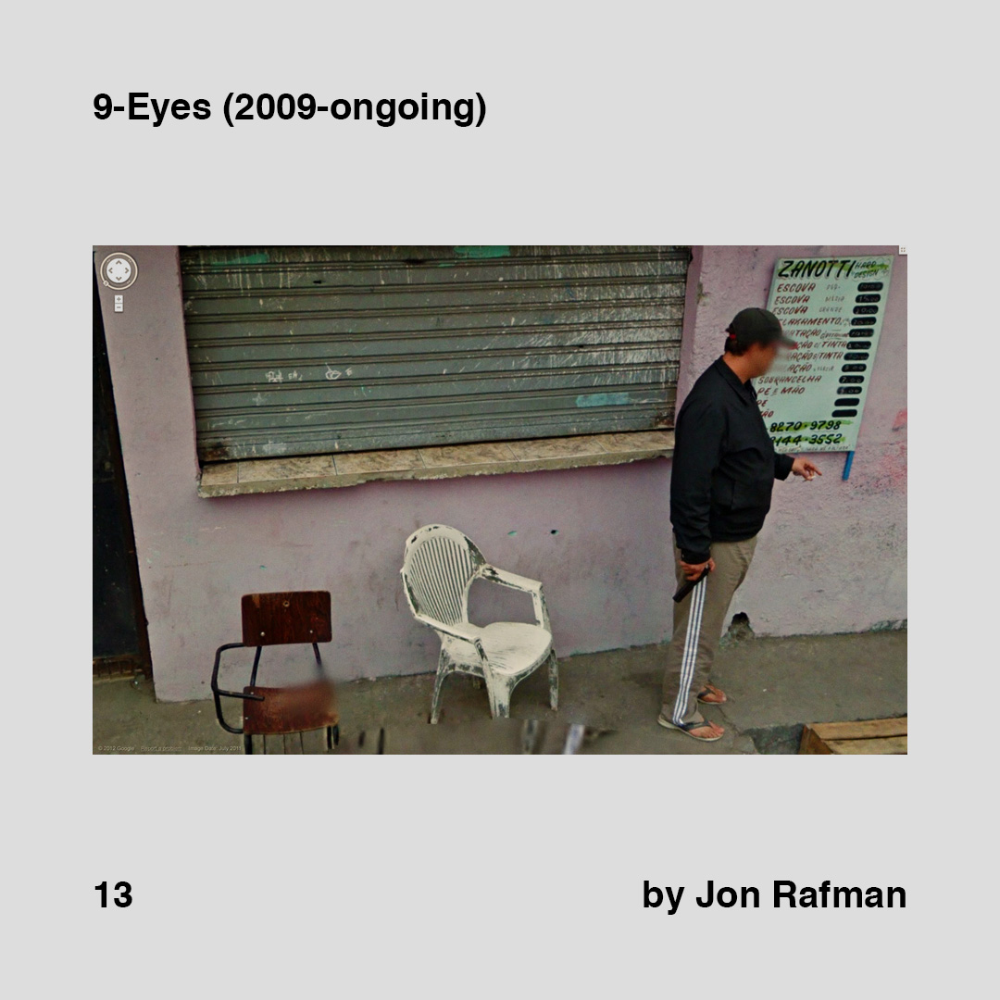
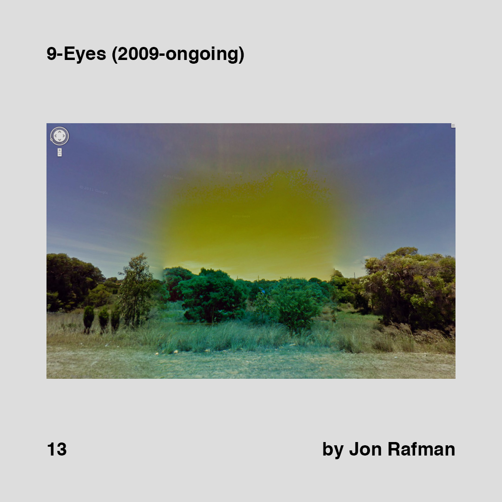
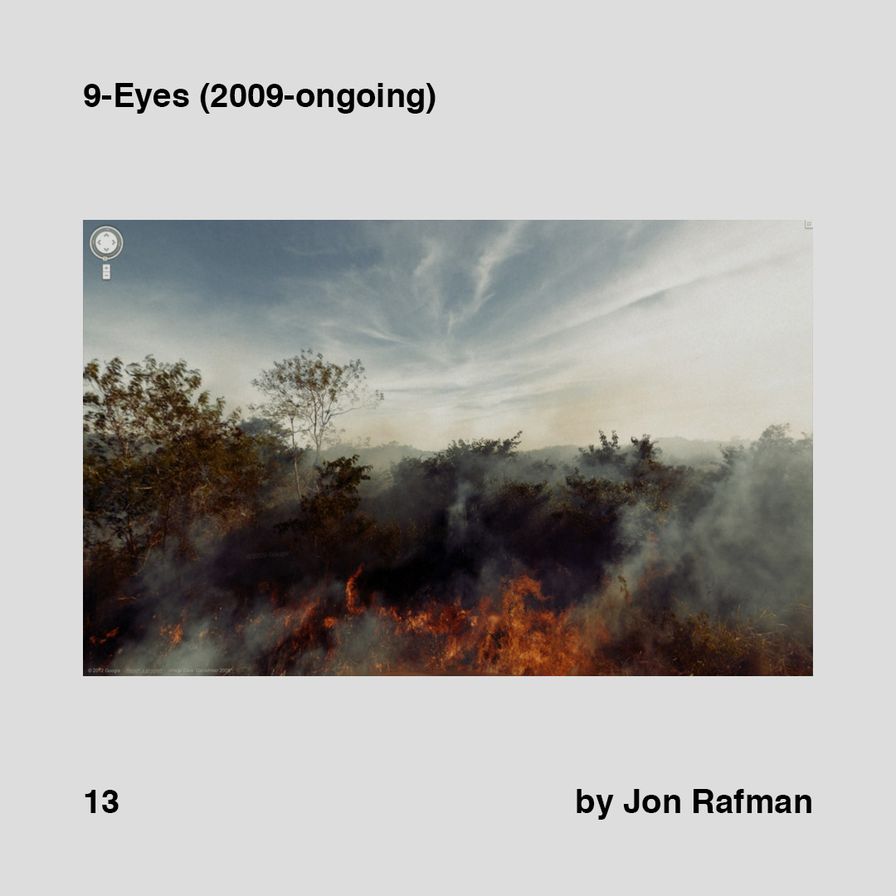
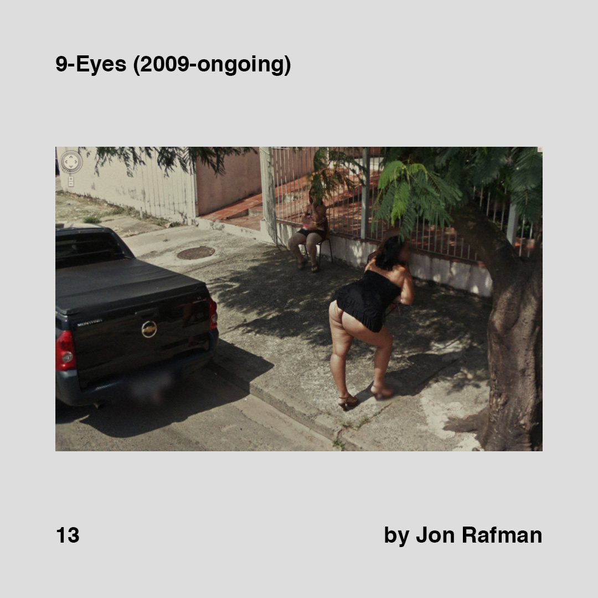
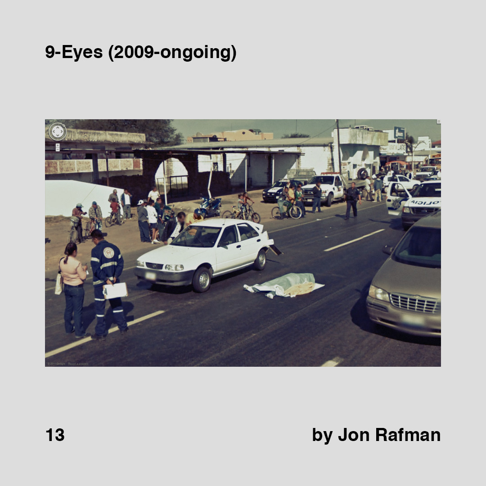
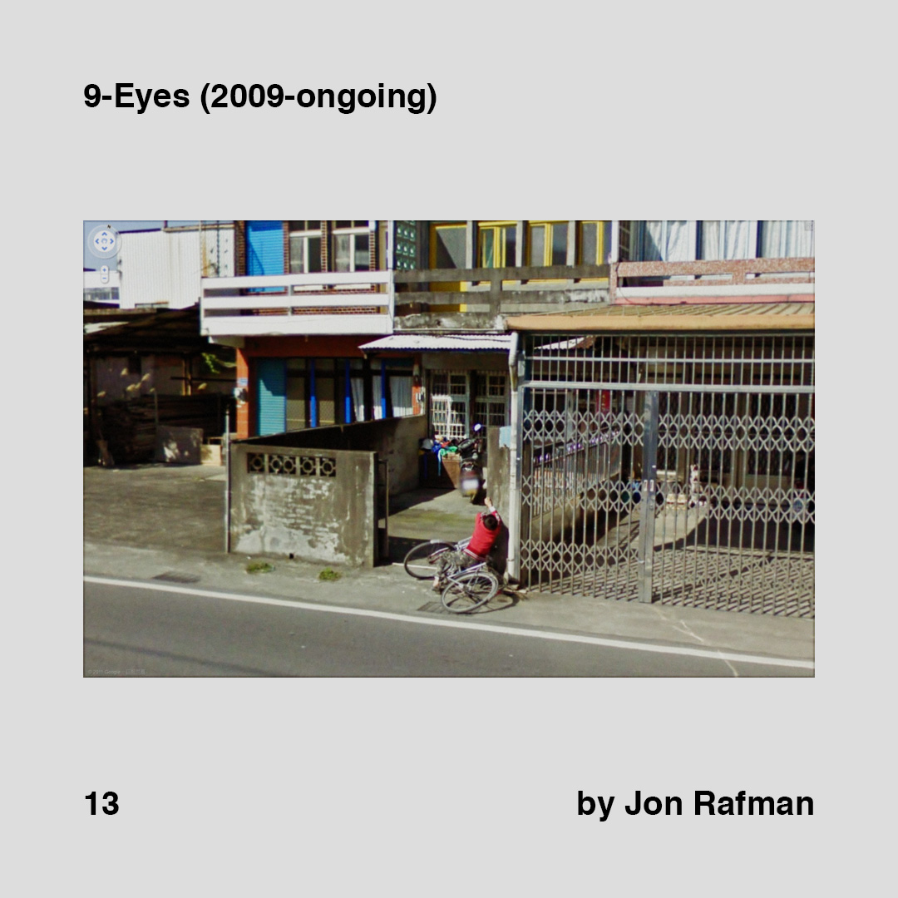

    

        
        
        
        
        
    

    

        
        
        
        
        
    

>[Posted](202106221357) on May 30, 2018

>9-Eyes (2009-ongoing)  
>by Jon Rafman

New discovery. @jonrafman and his artwork called 9-Eyes, an online collection of images from Google Street View.

Thanks to @esthermiquel for sharing his work.

Link in the bio.

#daa_inspiration  
#daa_artwork  
#daa_13