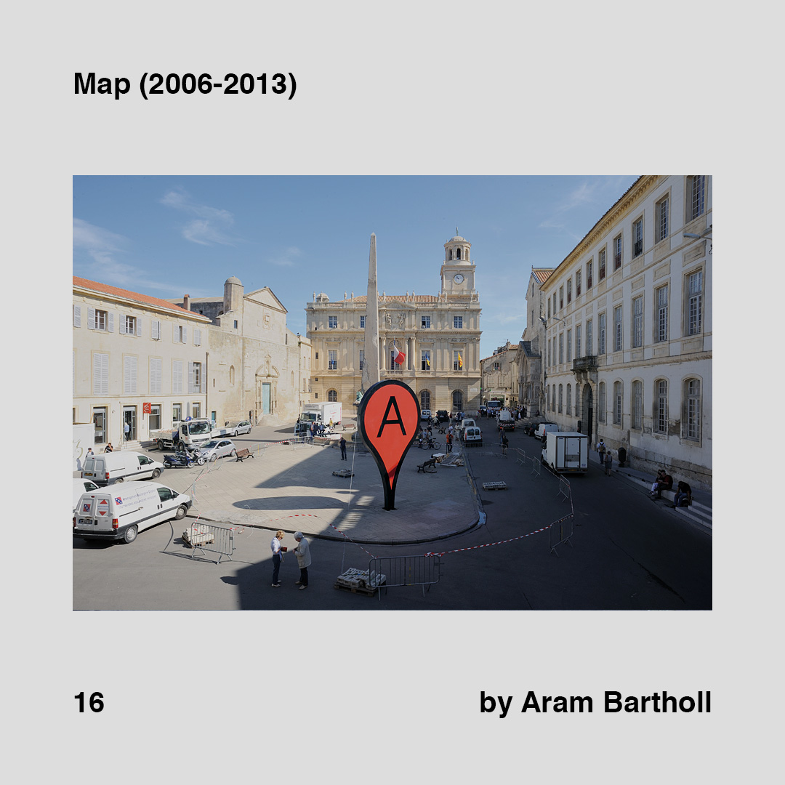

    

        
        
    

>[Posted](202106221357) on Jun 03, 2018

>Map (2006-2013)  
>by Aram Bartholl

One of this profiles with a difficult labeling. Media artist, conceptual artist, post-digital artist or interdisciplinary artist. Which one sounds cooler for you?

Do you already know @arambartholl ’s work? In which one do you think he fits better?

I’m gonna share more from him in the future for sure. Check the link in the bio to jump directly to his site.

Related to [#daa_13](201805302115)

#daa_inspiration  
#daa_artwork  
#daa_16