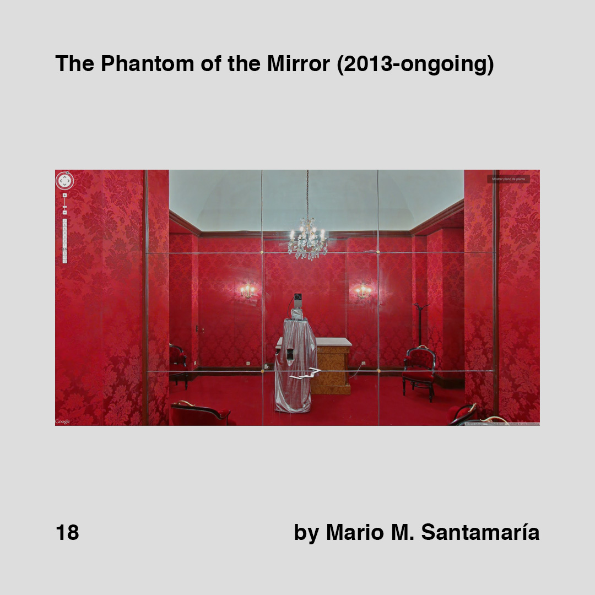

    

        
        
    

>[Posted](202106221357) on Jun 04, 2018

>Mirrors Behind the Curtain (2011-ongoing)  
>by Chadwick Gibson

>The Phantom of the Mirror (2013-ongoing)  
>by Mario M. Santamaría

Google’s street view trolley taking selfies accidentally, one of the references for #artificialselfie

Two projects capturing the same idea. How do you react when you encounter this kind of coincidences? ;-)

First found @santamaria8368 then @chadvvick through a post in @motherboardvice

Related to [#daa_17](201806032133) [#daa_16](201806032128) and [#daa_13](201805302115)

#daa_inspiration  
#daa_artwork  
#daa_18