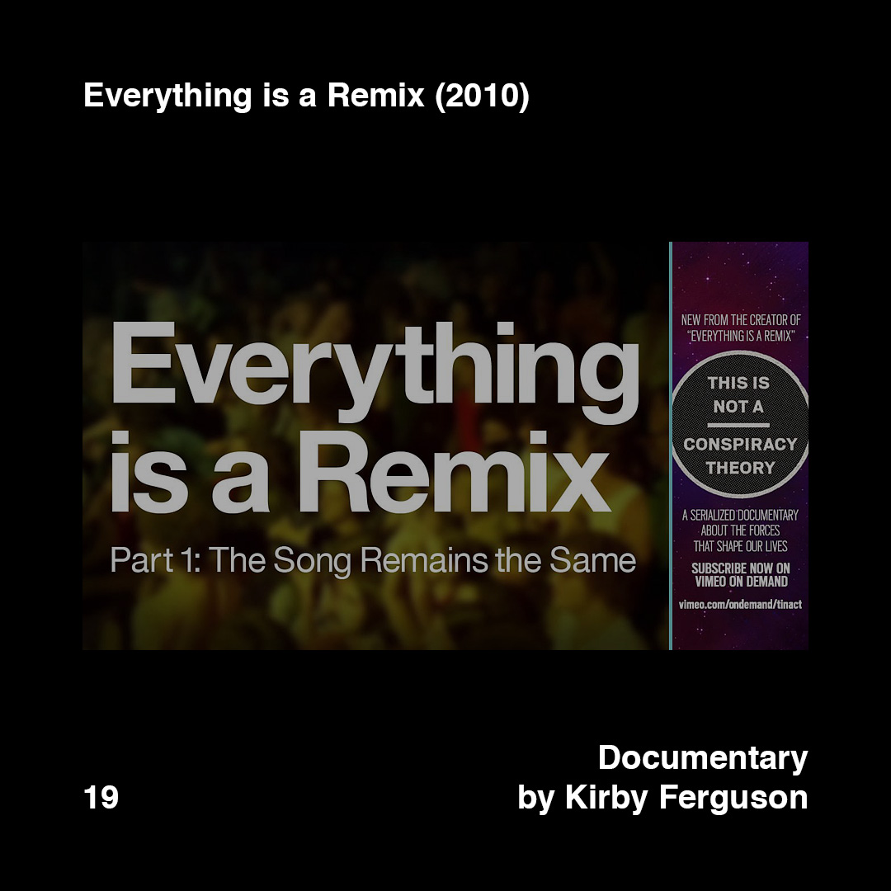
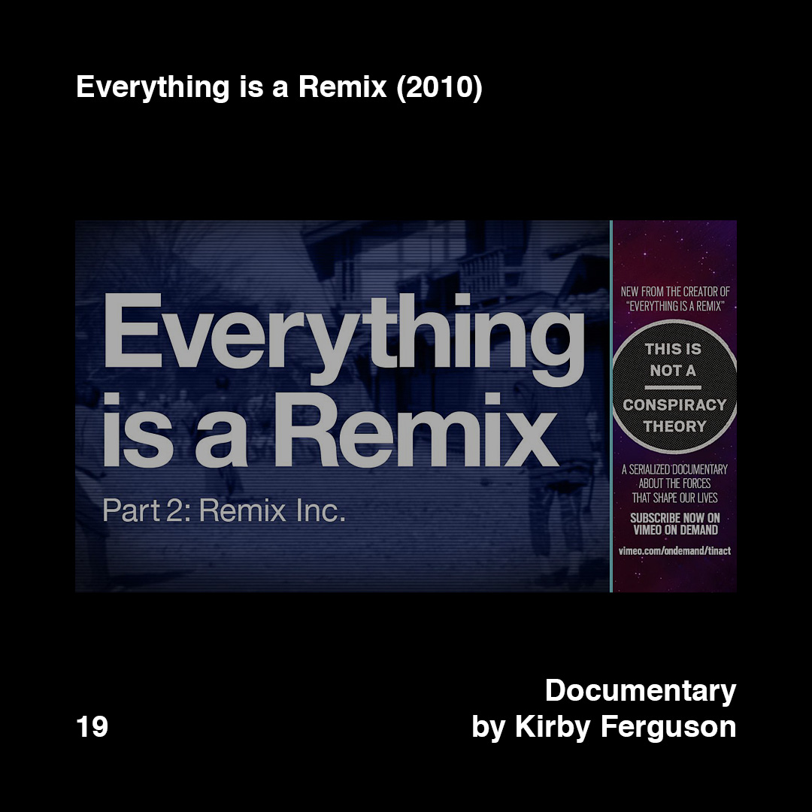
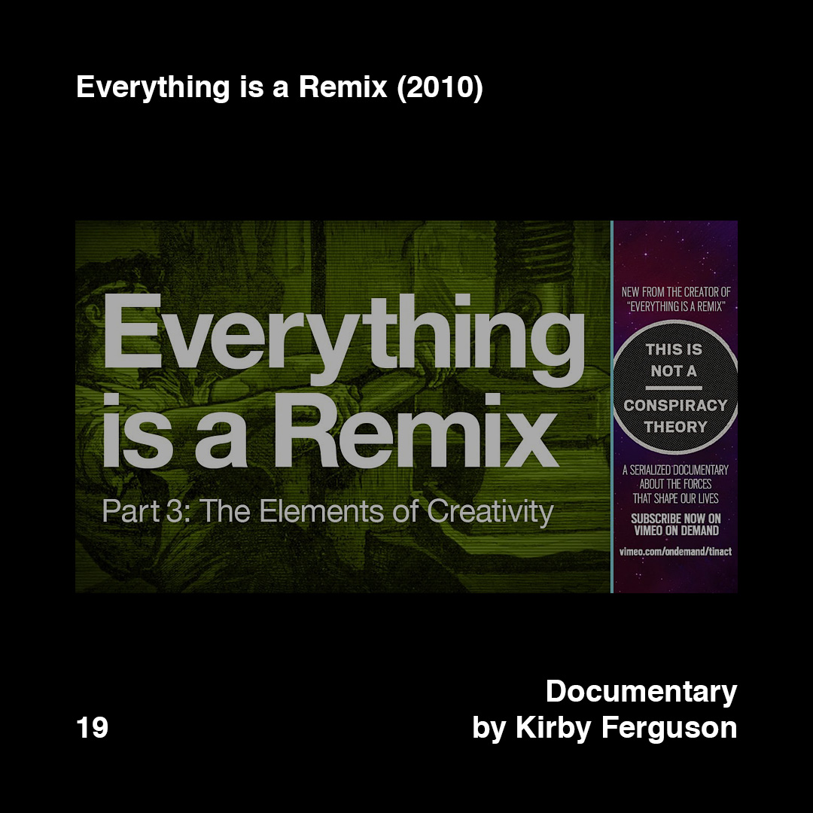
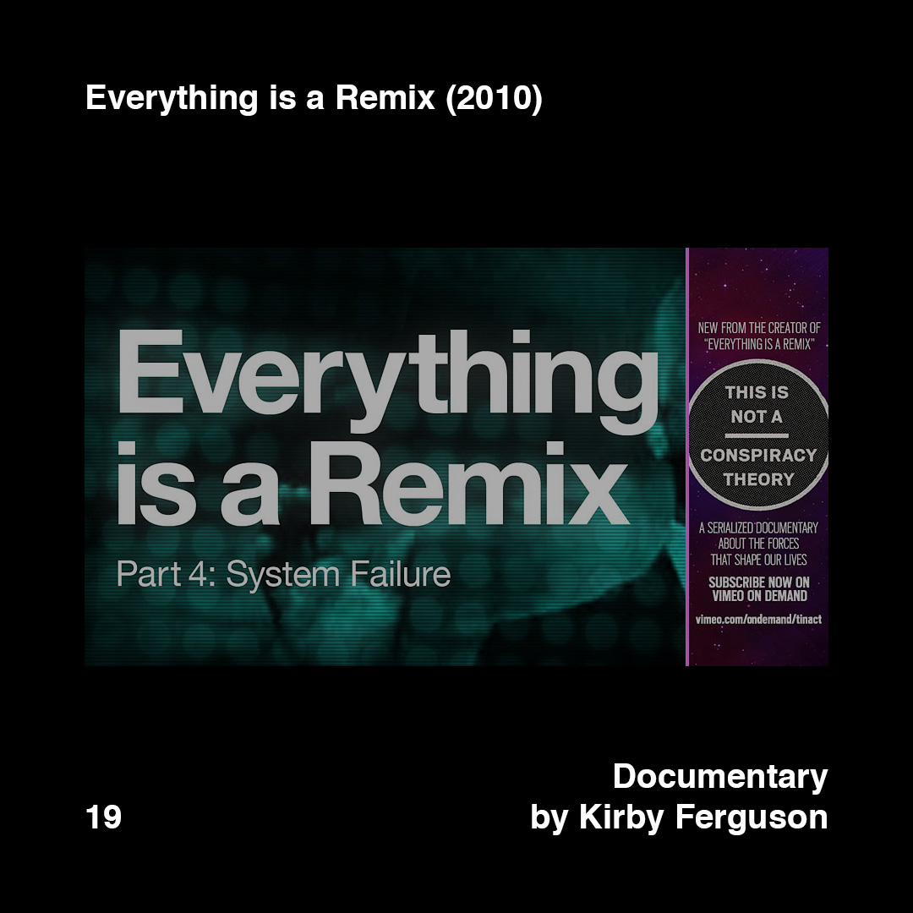

    

        
        
        
        
    

>[Posted]([[202106221357]]) on Jun 04, 2018

>Everything is a Remix (2010)  
>Documentary by Kirby Ferguson

A must to watch for any kind of creator (and depending how you define or understand the label of "creator" it could include almost everybody if we consider that all human beings are creative in some way or another).

Remember this formula: copy, transform and combine.

“Our creativity comes from without, not from within. We are not self-made. We are dependent on one another, and admitting this to ourselves isn't an embrace of mediocrity and derivativeness. It's a liberation from our misconceptions, and it's an incentive to not expect so much from ourselves and to simply begin.” — excerpt from his TED talk

Links in the bio.

Related to [#daa_18]([[201806042138]]) [#daa_2]([[201805221408]])

#daa_inspiration_to_watch  
#daa_documentary  
#daa_19