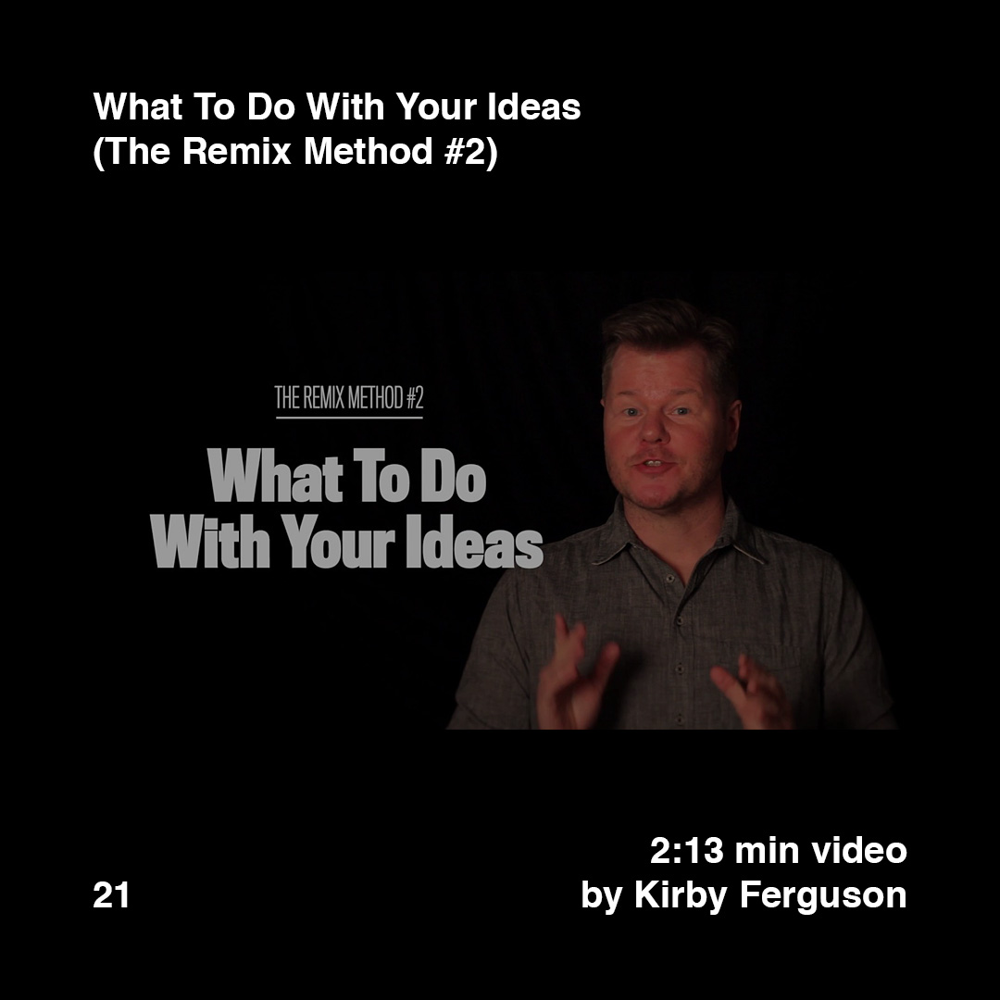

    

        
        
    

>[Posted](202106221357) on Jun 04, 2018

>The 4 Steps to Getting an Idea (The Remix Method #1)  
>3:48 min video by Kirby Ferguson

>What To Do With Your Ideas (The Remix Method #2)  
>2:13 min video by Kirby Ferguson

Two short videos worth to share, again by Kirby Ferguson, the guy behind “Everything is a Remix”. Discovered the other day preparing the post [#daa_19](201806042144)

Plain and simple.

The 4 steps to getting an idea:  
1— Create boundaries  
2— Consume everything  
3— Digest the research  
4— Drop it

Links in the bio.

#daa_inspiration_to_watch  
#daa_video  
#daa_21