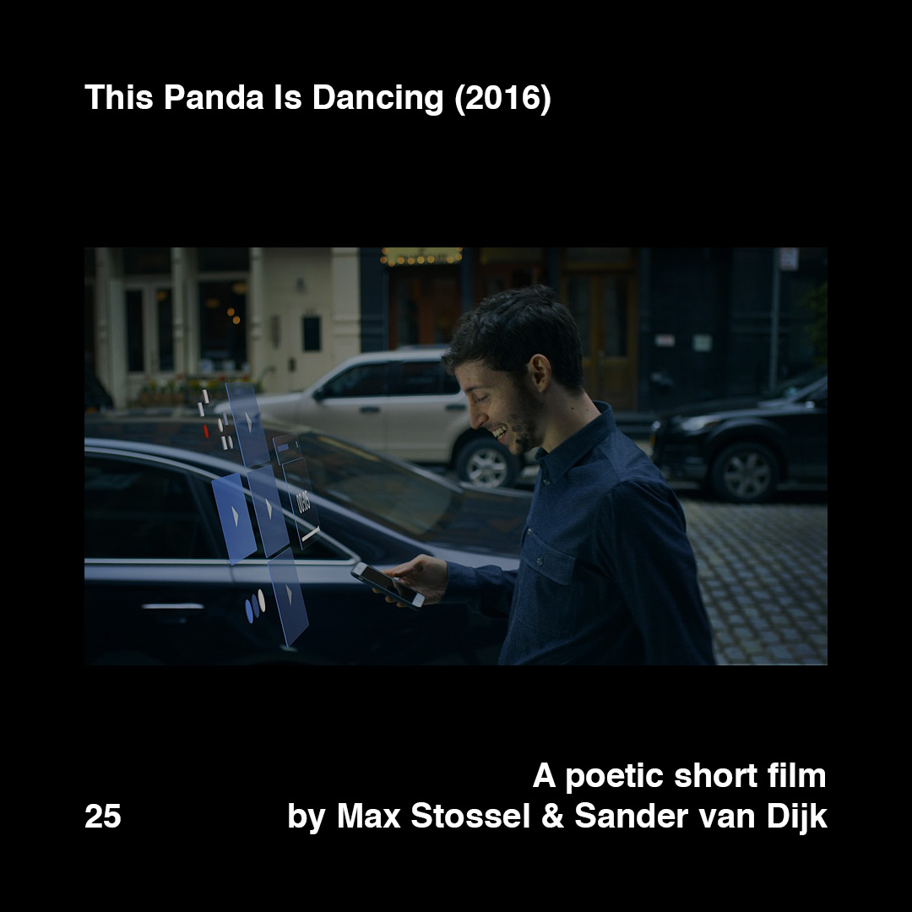

>[Posted](202106221357) on Jun 12, 2018

>This Panda Is Dancing (2016)  
>A poetic short film  by Max Stossel & Sander van Dijk

Do you remember the exhibition #designdoes? I was there presenting “Follow”, embodying the question “Who controls who”. Did you read the information panel? Maybe you remember a small section at the bottom called “Want to learn more?” with three projects/initiatives. The first one was “Time well spent”, rebranded now to “Center for Humane Technology”.

This one was my main reference from the point of view of design. Since 2013, they are successfully raising awareness of the problem of how technology is hijacking our minds and society.

Some questions to make you think, from the video description:

What if news & media companies were creating content that enriched our lives, vs. catering to our most base instincts for clicks?

What if social platforms were designed to help us create our ideal social lives, instead of to maximize time-on site and “likes”?

What if dating apps measured their success in how well they helped us find what we’re looking for instead of in # of swipes?

Links in the bio. “Follow” in the IG highlighted stories.

Related to [#daa_23](201806062246) [#daa_22](201806062241) [#daa_17](201806032133) [#daa_4](201805232317) [#daa_3](201805231412)

#daa_inspiration_to_watch  
#daa_video  
#daa_25