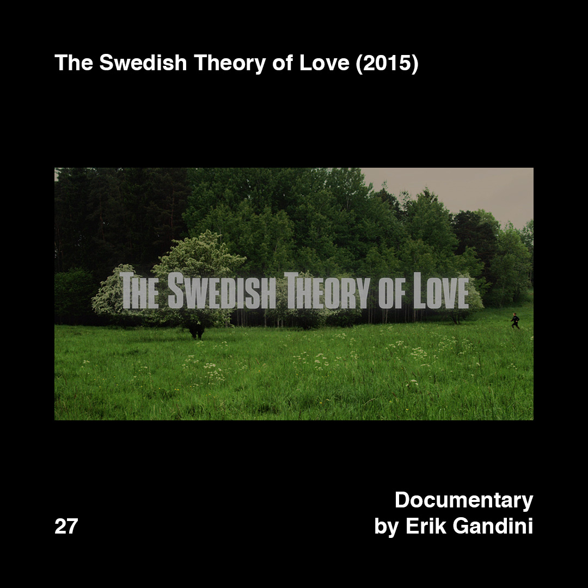
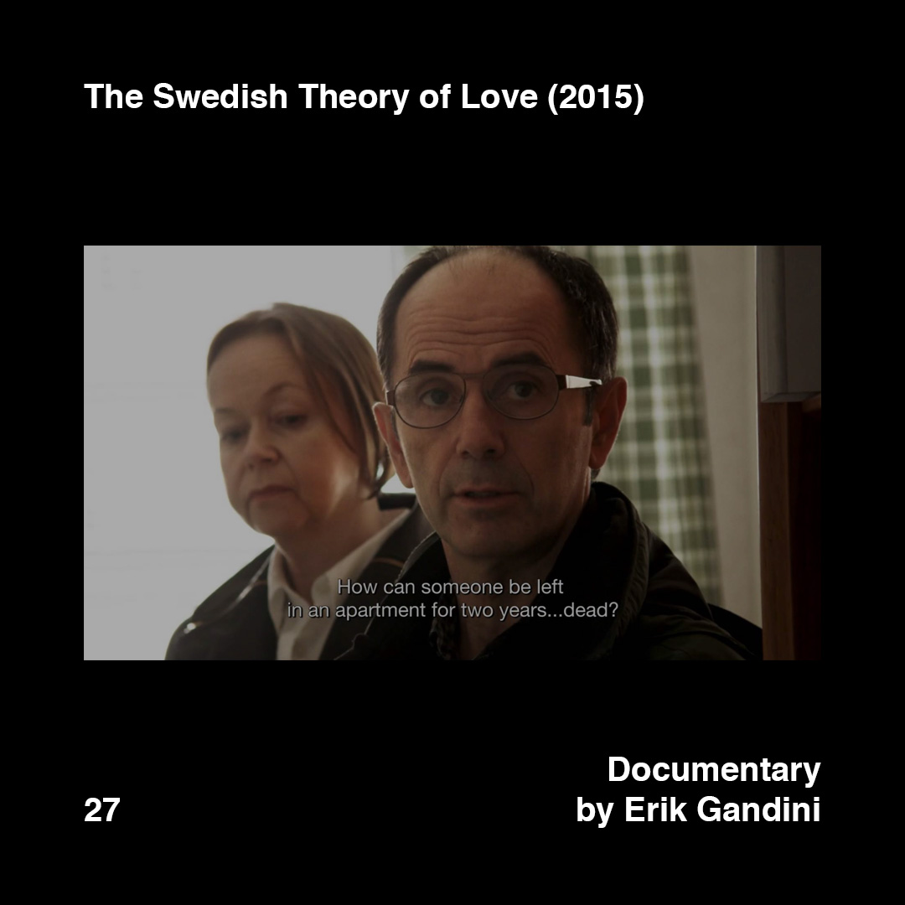

    

        
        
    

>[Posted]([[202106221357]]) on Jun 27, 2018

>The Swedish Theory of Love (2015)  
>Documentary by Erik Gandini

Documentary connected to the last question [#daa_26]([[201806272257]])

“Sweden is typically portrayed as having a perfectly organized society, a raw model and symbol of the highest achievements of human progress. The Swedish Theory of Love digs into the true nature of Swedish life style, explores the existential black holes of a society that has created the most autonomous people in the world.”

Link in the bio.

#daa_inspiration_to_watch  
#daa_documentary  
#daa_27