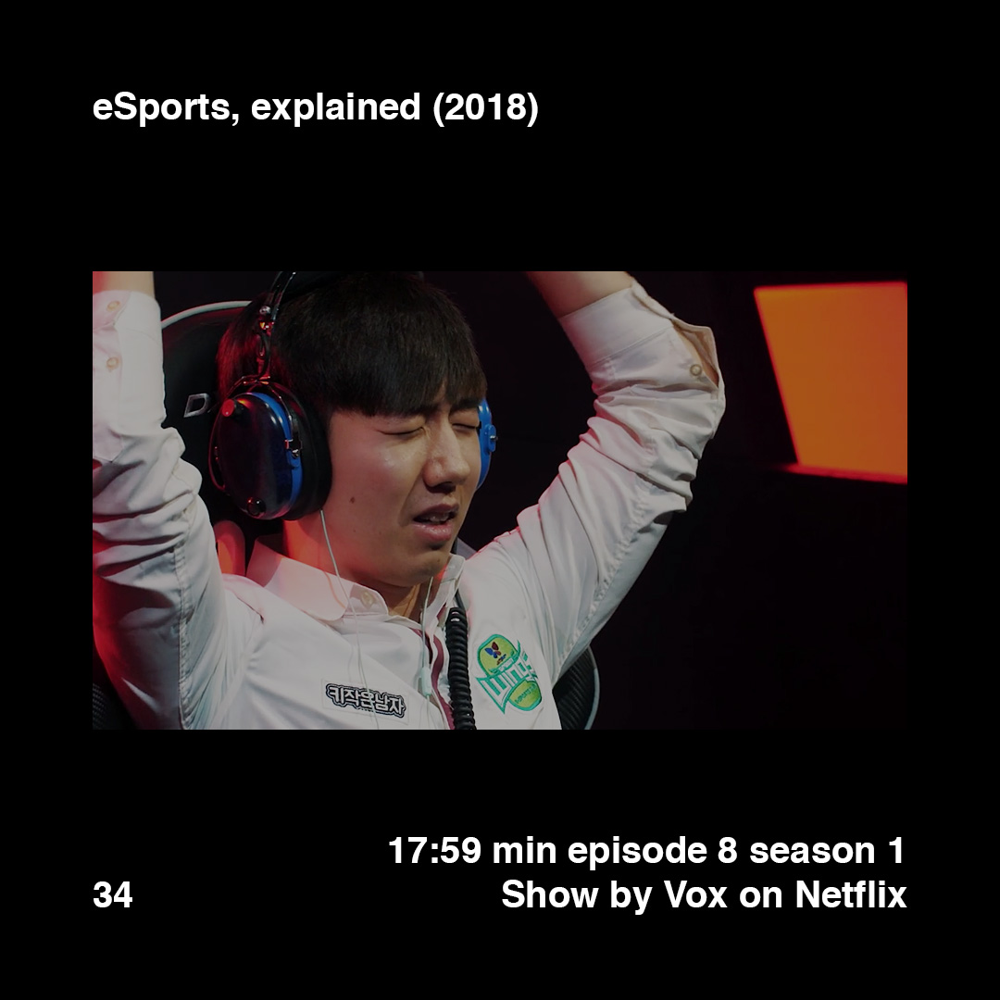

    

        
        
    

>[Posted]([[202106221357]]) on Jul 10, 2018

>eSports, explained (2018)  
>17:59 min episode 8 season 1  
>Show by Vox on Netflix

I’ve never considered myself a gamer, although I've had times in my life where video games played an important role.

For example, games like The Secret of Monkey Island or Day of the Tentacle inspired me to create my own adventure game when I learnt Visual Basic at school, and I used Pokemon sprites as starting point to develop my own characters for the game. Half Life was the first first-person video game that really made me feel inside the body of the protagonist. GTA III was my introduction to open virtual worlds. Counter Strike and Age of Empires showed me the power of multiplayer games and their effect on interpersonal relationships.

What video game among all you played do you think had the greatest impact on your life?

We are evolving faster than ever, and video games, especially the e-sports scene compared with tradicional sports, act as a vivid portrait of this constant and super-fast change, and how we adapt to it.

Episode recommended by @pumh and @ninethousandpics during a conversation with other two gamers @ramonescola and @manuelsuarez

Same show [#daa_9]([[201805272035]])

#daa_inspiration_to_watch  
#daa_documentary  
#daa_34