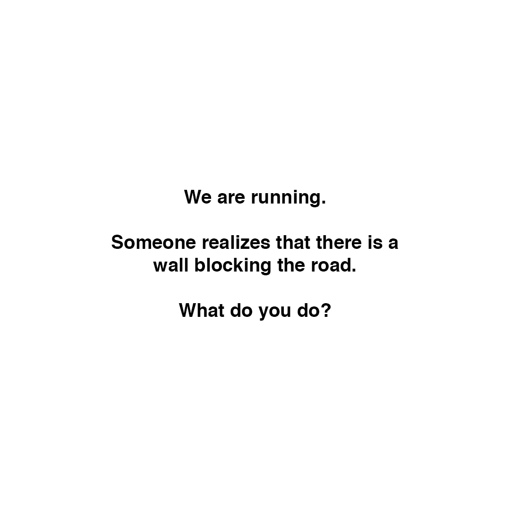

>[Posted](202106221357) on Mar 29, 2019

>We are running.  
>Someone realizes that there is a wall blocking the road.  
>What do you do?

a) do not stop running and close your eyes tightly in the last few meters before hitting the wall

b) run faster as you get closer to the wall and try to jump it

c) turn right or left following the wall

d) reach the wall just enough to touch it and keep running in the opposite direction

#daa_doing  
#daa_thought  
#daa_38