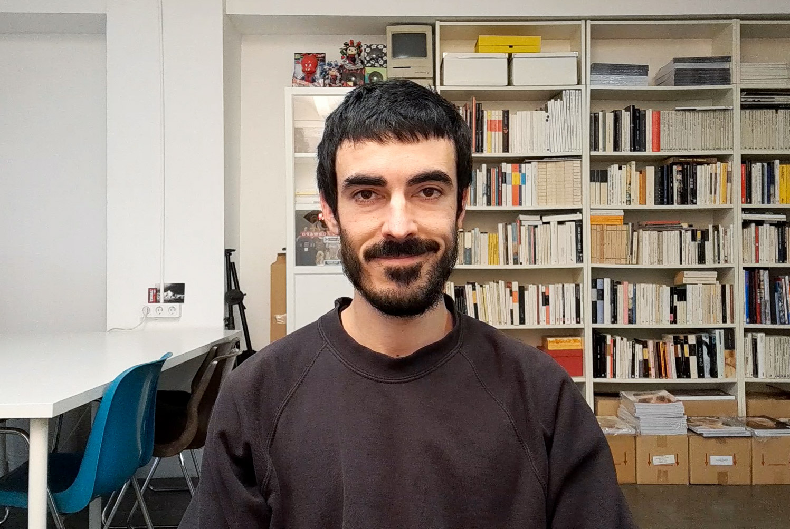

<!--  -->

# Hello! 👋

My name is Daniel Armengol Altayó, and I am here to participate in the conception and creation of alternatives to the current digital paradigm. My hypothesis is that by having more clarity on how digital information operates and how we relate to it, we can coordinate efforts more effectively towards common goals.

[This website is an experiment]([[202108311605]]). Right now you can explore my [artistic practice]([[202103150041]]), and my plan is to share my [research notes]([[202103120337]]) as well, understanding both as complementary to each other.

[Vio]([[202104071256]]) · [Join my mailing list](https://tinyletter.com/danielarmengolaltayo) · [Get in touch](mailto:daniel@armengol-altayo.com?subject=Hi Daniel!)

>↑ Frame from [Pointless]([[202105291521]]).