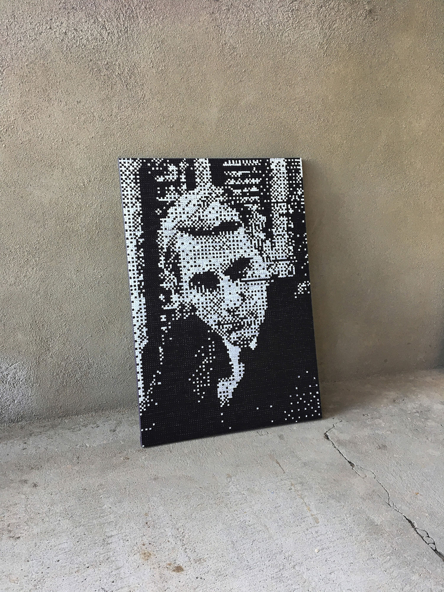

  

**29784 shannons**, 2020  
*Performance*

We are information processing machines, living in the digital age.

In computing, the basic unit of information is the bit, a binary digit that represents a logical state. True or false, one or zero, yes or no, black or white, on or off, positive or negative.

Only by arranging ones and zeros we can create extremely complex systems that allow us to expand our capacity to process information, and consequently, radically modify our way of understanding and relating to reality.

<iframe src="https://player.vimeo.com/video/443870804?title=0&byline=0&portrait=0" width="640" height="360" frameborder="0" allow="autoplay; fullscreen; picture-in-picture" allowfullscreen></iframe>