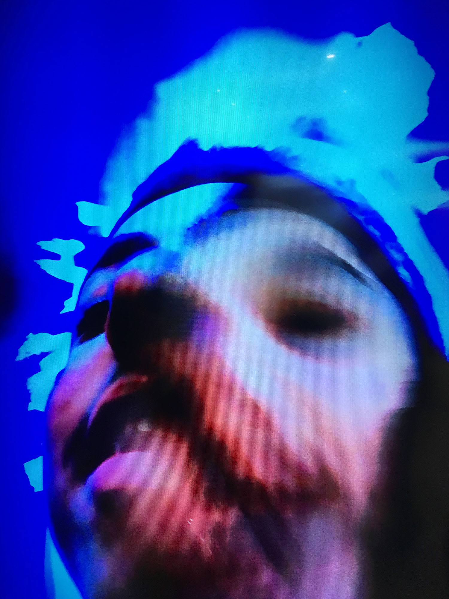

**I am a strange loop**, 2017  
*Installation*

A mirror mirroring a mirror. A selfie as a projection of the self. Artificial intelligence proficient at recognizing its surroundings, capable of learning and even dreaming. Psychedelia.

An interface, deeply immersed on observing its own self, posing and taking selfies, folding endlessly in a vain exercise of technological introspection. An exercise that we can interrupt at any moment by standing in between of the devices, and so fall into an altered state of shared consciousness. 

The piece is executed with hardware and software with the default factory settings, which correctly aligned have the power to hypnotize us with a visual effect, strangely organic.

    

        
    

    

        
    

