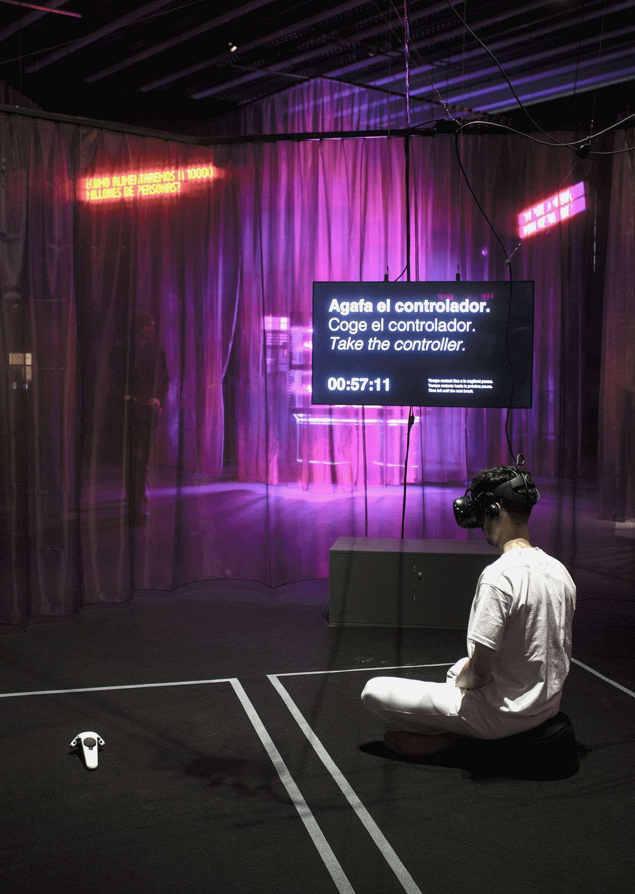

Two spaces of identical dimensions. I inhabited the space on the right side of the image, equipped with a controller and a virtual reality headset. In the other space there was a controller on the floor, waiting for someone to pick it up. 

When visitors took the controller and moved it, they also moved the controller I was holding in my hand, giving the illusion of being able to control my movements, as if [I were a human puppet]([[202103150141]]).

>↑ Photo by Xavi Padrós.