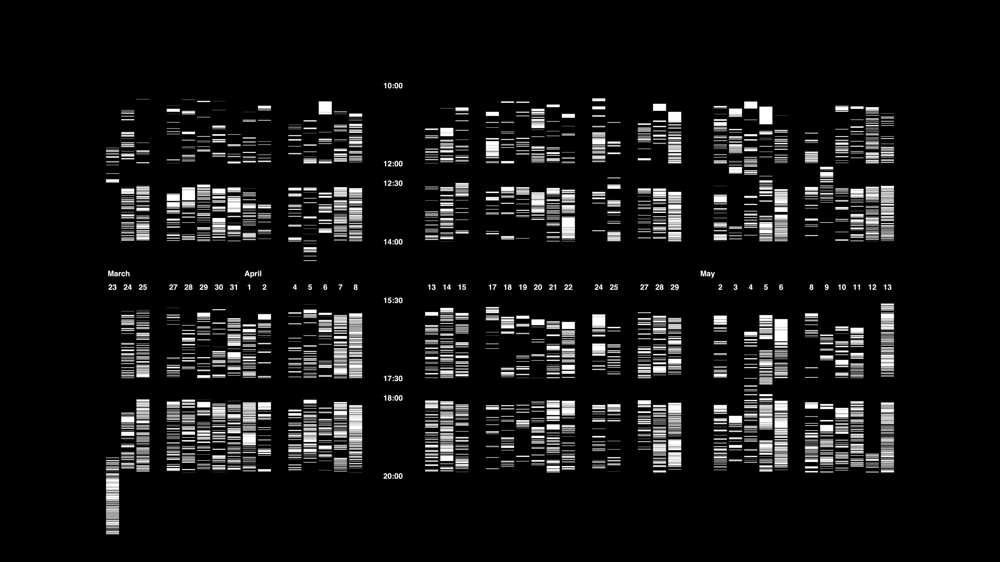

This graph displays the activity recorded during [the performance]([[202103150141]]). The horizontal axis represents the days. The vertical axis, the hours. Each line represents an interaction and an interaction started to count when someone picked it up the controller from the floor and stopped the moment they put it down again. 

**4840 interactions counted, at an average of 1 minute per interaction, spread over 40 days, during the two months of the exhibition.**