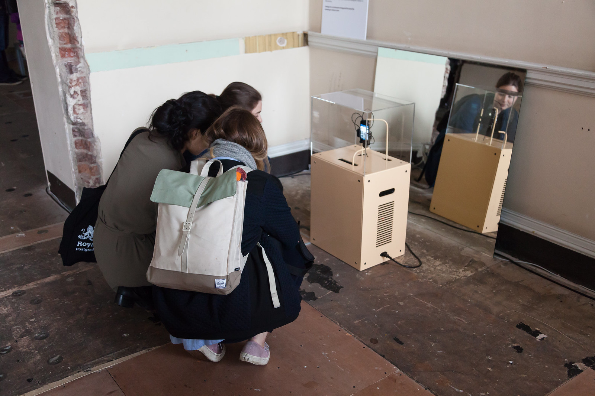

[#artificialselfie](202104131142) exhibited at [Art of Bots](https://www.flickr.com/photos/danielarmengolaltayo/sets/72157667837669896).

15/04/16 → 16/04/16  
Somerset House, London, GB.

>"Over recent years tiny automated and nonsensical beings have infiltrated our daily life via twitter and email. They have taken delight in agitation by imitating human behaviours – from telling jokes to online-dating. These small computer programmes are called bots (derived from the word robot) and their repetitive and often simple actions have brought fun to – and often poked fun at – the Internet platforms that now mediate our lives." *Excerpt from the [website of the exhibition](https://www.andfestival.org.uk/events/art-of-bots-london/).*

>↑ Photo by [Abandon Normal Devices](https://www.flickr.com/photos/andfestival/26284522450/in/album-72157667037666470/).  