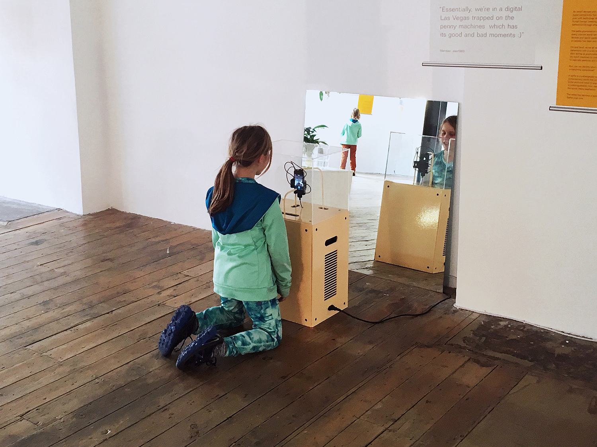

[#artificialselfie](202104131142) exhibited at [Unread Messages](https://www.flickr.com/photos/danielarmengolaltayo/sets/72157665522945334).

11/03/16 → 09/04/16  
The Aram Gallery, London, GB.

An exhibition about rethinking our relationship with technology.

>"Unread Messages, a pioneering research and design project exploring the ways in which technology is affecting how we think, act and behave." *Excerpt from the [website of the exhibition](http://unreadmessages.com/about/).*