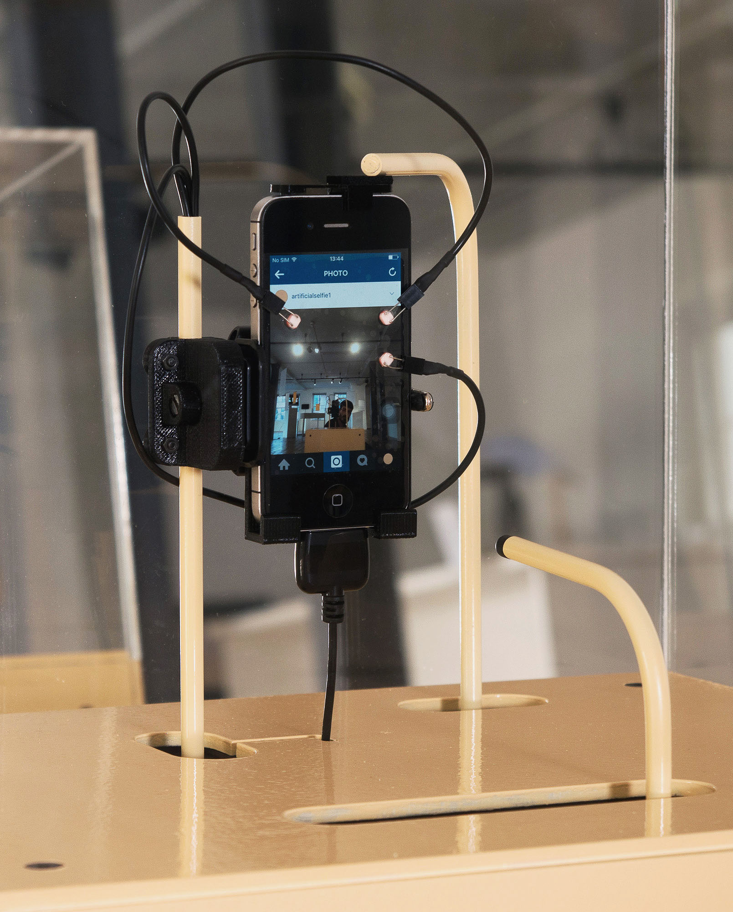

[#artificialselfie](202104131142), 2016

# A selfie is a paradigmatic way to prove to the contemporary world that one exists.

The robot expresses this need by taking selfies of itself and sharing them on Instagram, repeating the same sequence tirelessly, over and over again, at a pace of one selfie every three minutes.

It uses a mirror to reflect its image, [including the audience as part of its digital life](202104131147).