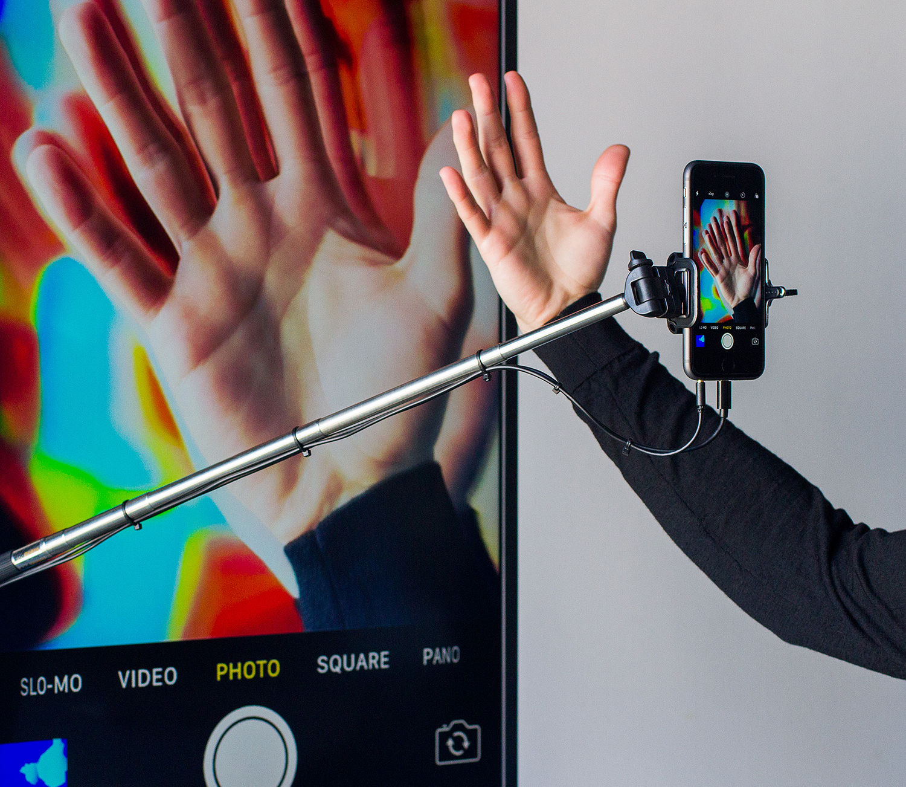

[I am a strange loop]([[202103150108]]), 2017

TV screen mounted on a tripod, holding a selfie stick with a smartphone. The smartphone has the camera app open, and it is wired to a computer, which mirrors the screen of the smartphone, at full-screen. An Arduino board hooked to the phone jack triggers the smartphone camera [at a random interval]([[202104150222]]), [reducing any human intervention]([[202104150315]]) [to a mere coincidence]([[202104150234]]).

The piece is executed with hardware and software with the default factory settings, which correctly aligned have the power to hypnotize us with [a visual effect]([[202104150237]]), [strangely organic]([[202104150322]]).