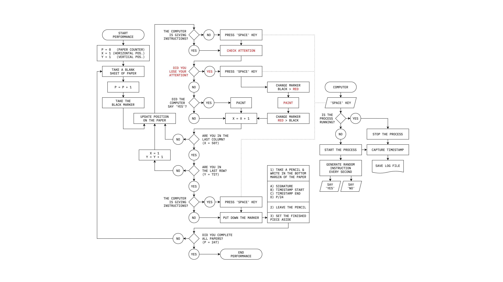

These are the rules that governed my actions during [the performance](202105291521). The diagram shows the same logic, but visually.

- **STEP 1)** Sit in front of the paper, the computer and the black and red markers. Focus your attention on the first square delimited by the grid printed on the paper, and start the computer's process: emit a "yes" or a "no", randomly, every second.
- **STEP 2)** If the computer says "yes", paint the square you are focused on, using the black marker, and move to the next square (left to right, top to bottom). If the computer says "no", just move to the next square. Repeat until you reach the end of the paper.
- **CONDITION A)** If you lose your attention, stop the computer's process, paint the next empty square with the red marker, and when you are ready to continue, restart the computer's process, and repeat step 2.
- **CONDITION B)** When you reach the end of the paper, repeat from step 1, until you complete the 24 papers.
- **IMPORTANT)** Keep all breaks as short as possible.