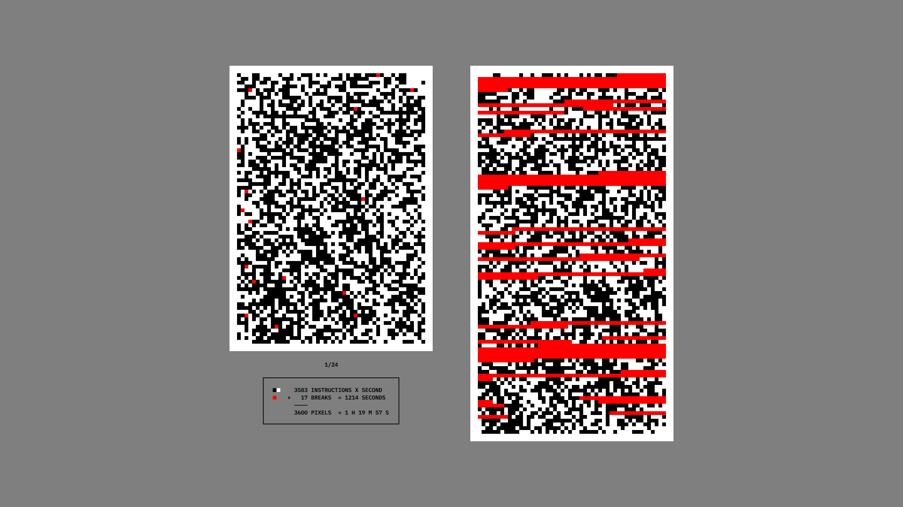

>↑ On the left side of the image is the result of the first sheet, digitized. On the right side, a visualization of the time needed to complete the same sheet.

The red points represented [those moments in which I had to stop because I had lost my attention](202105291521), but although they occupied one square, they did not equal to one second. After the performance I can process all the information to visualize the real time needed to complete each sheet, expanding the red points until they occupy the exact number of seconds corresponding to each break. 

The image contrasts the theoretical completion time of [one hour per sheet](202105311723) (left) with the actual time required to complete the first sheet (right). 

**I knew the minimum time of one hour to complete a sheet, but I could not accurately predict the time it would take to complete each sheet.** Even less, [the total time to complete all 24 sheets](202105291803).