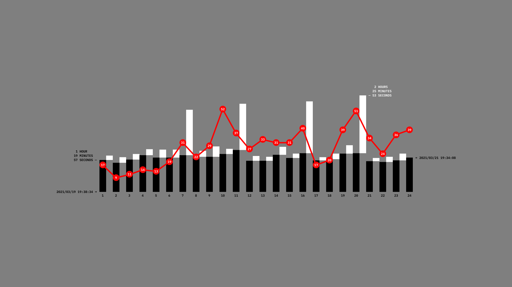

>↑ The black bars represent the time for completing each one of the sheets of paper. The white bars, the time between sheets, and the red dots, the number of times I had to stop per sheet because I had lost my attention.

This image shows how the amount of times I had to stop decreases after the long breaks I used to get some sleep (7-8, 11-12, 16-17 and 20-21).

The graph generated by the red dots is quite consistent, except on sheet 1 and 10, when Poncho was there documenting [the performance](202105291521), which made it difficult for me to stay focused on the task. He was there at the end of sheet 24, but no relevant alteration can be perceived in the graph. I stayed alone the rest of the performance to reduce distractions.