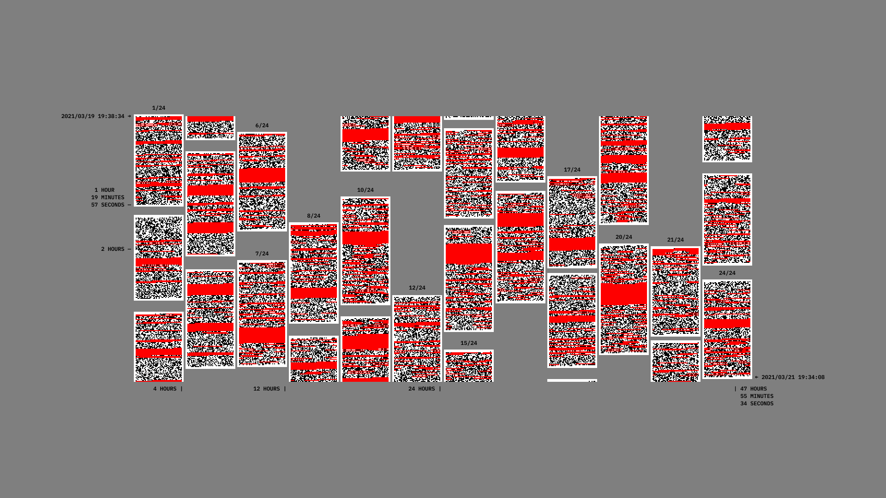

>↑ Every second of [the performance](202105291521) in a single image.

The image contains, with a precision that reaches the second, the captured instructions, the moments when I lost my attention and the pauses between sheets. 

**The performance lasted 47 hours, 55 minutes and 34 seconds in total**, which means that the average time per sheet ends up being almost 2 hours, twice [the minimum time required](202105291511).