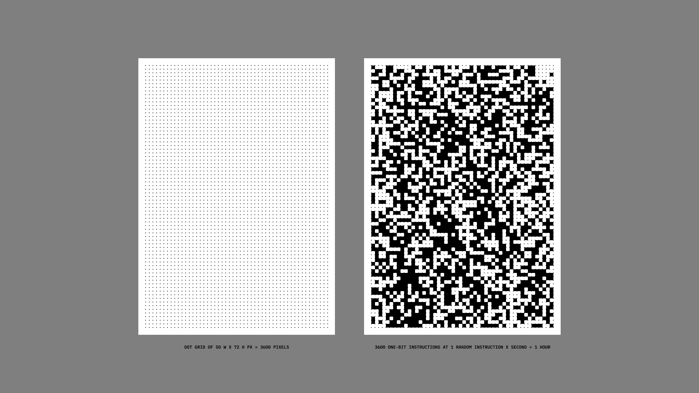

>↑ Empty grid on the left, grid filled with [random one-bit instructions](202105291521) on the right.

The sheet of paper had a dot grid of 50 W x 72 H cells printed on it (50 x 72 = 3600), meaning that **if the grid is filled at one instruction per second, non-stop, a sheet would be the equivalent of one hour** (1 hour = 3600 seconds).