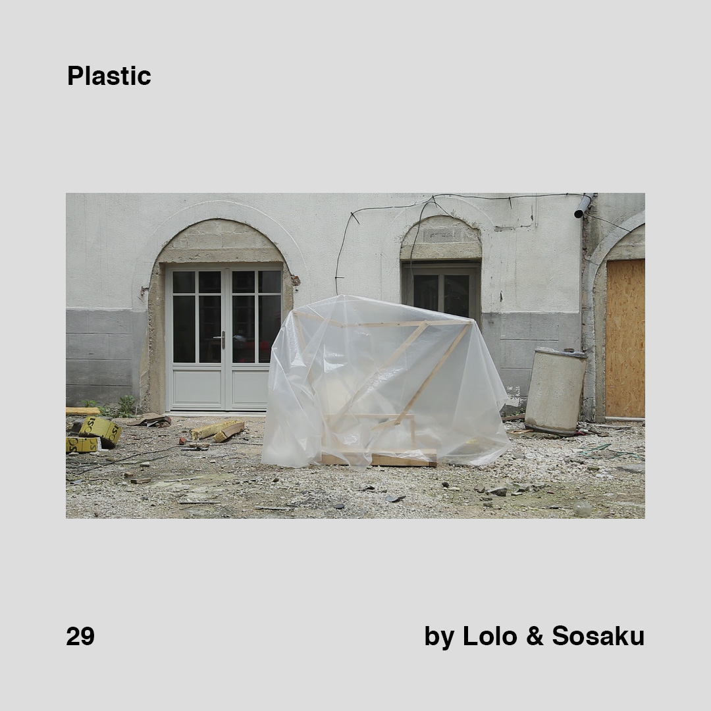
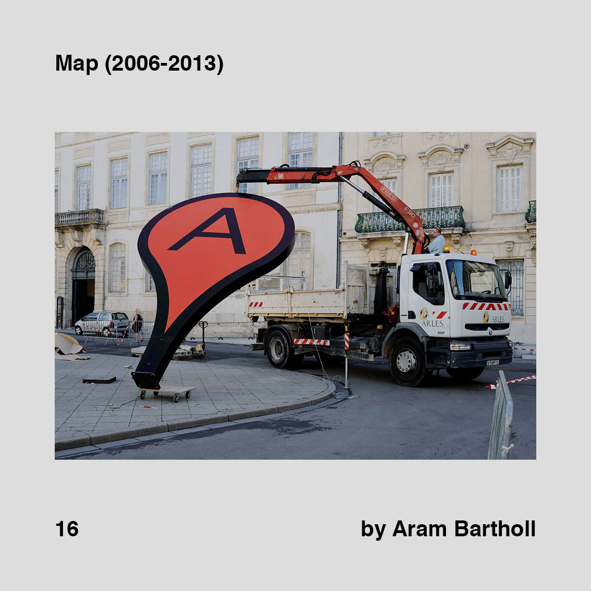
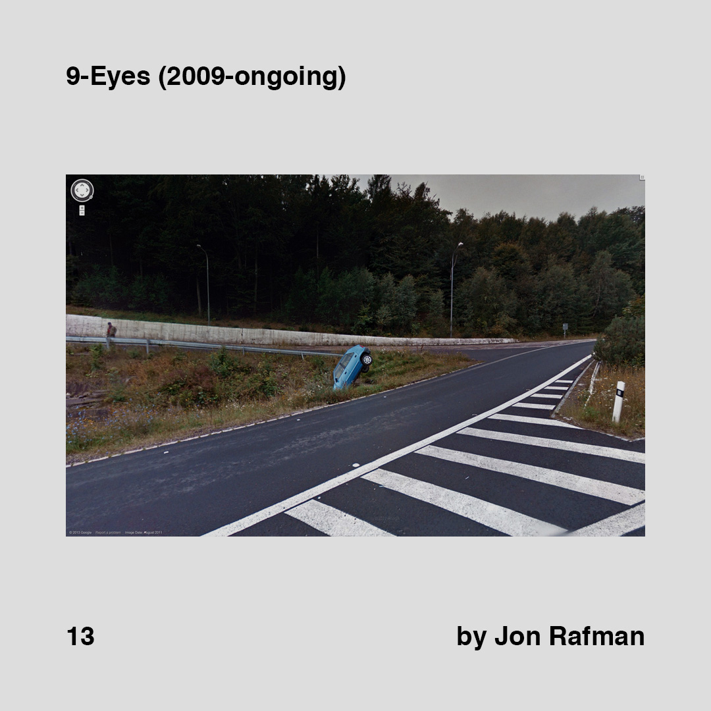
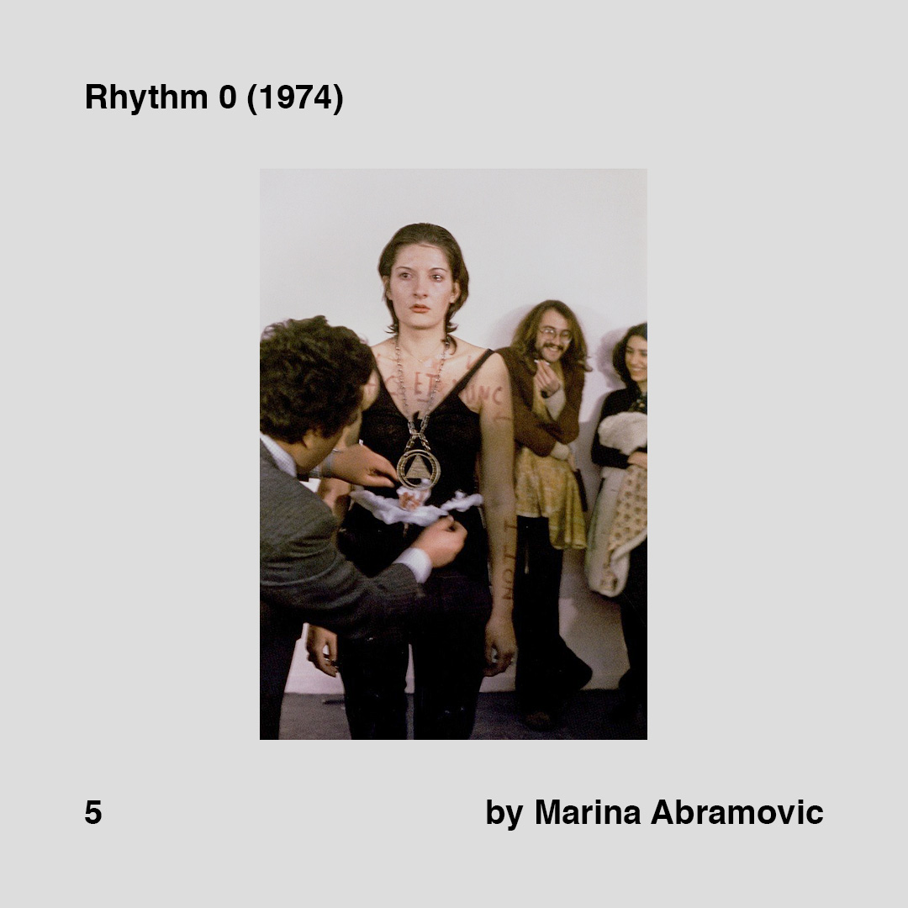
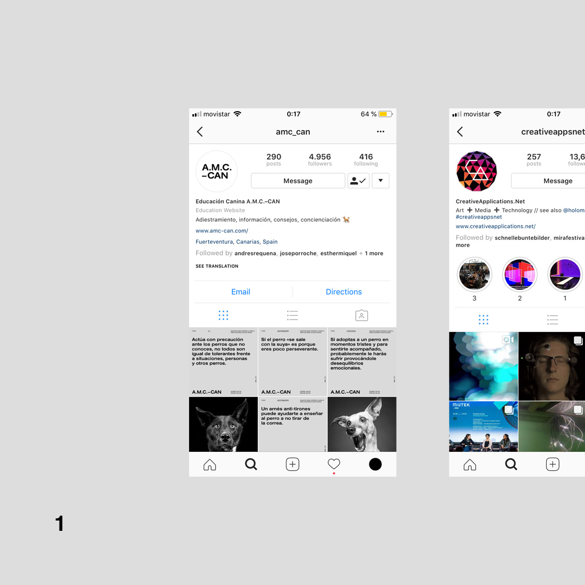

Instagram 22/05/18 → 04/04/19

- exploracio de conexions alternatives a les proposades per instagram dintre de instagram, fent servir els hashtags com a identificadors unics
- el unic link extern que et deixava posar instagram estava dedicat a recopilar totes les referencies mencionades
- el recull que hi ha a continuacio es el material que es va compartir a IG, simulant el resultat aconseguit (tinc posts actuals que fan de data viz?)

<!-- versio manual -->

    

        
        
        
    

    

        
        
        
    

    

        
        
        
    

    

        
        
        
    

    

        
        
        
    

    

        
        
        
    

    

        
        
        
    

    

        
        
        
    

    

        
        
        
    

    

        
        
        
    

    

        
        
        
    

    

        
        
        
    

    

        
        
        
    

    

        
    

<!-- versio template (no detecta el backlink) -->
<!-- 



    
    
    

 -->

