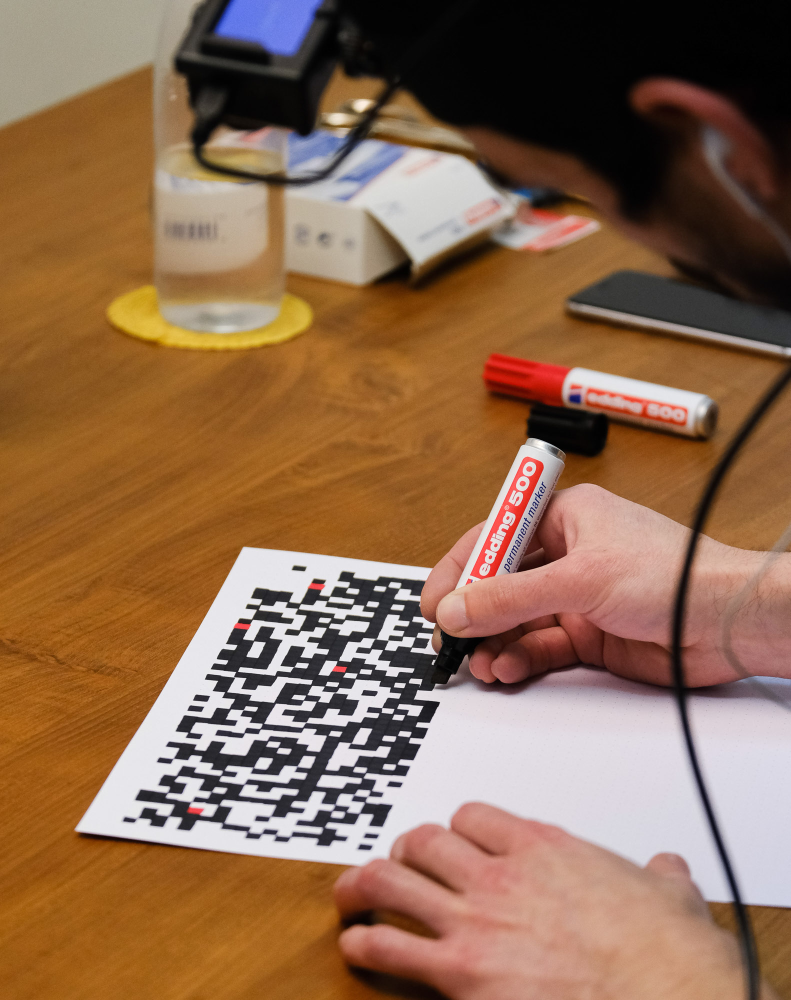
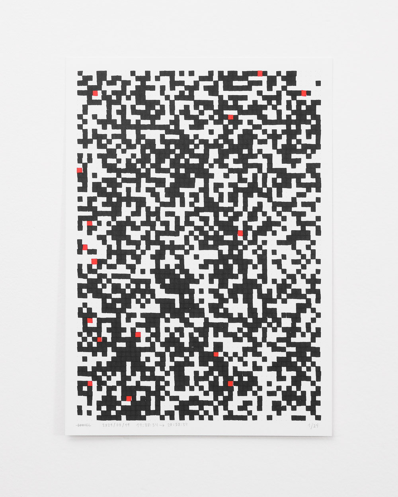

TL;DR aka visual summary

(textos a revisar)

Using a marker on a sheet of paper, I had to either paint or leave it blank according to the computer’s commands, randomly generated by at a rate of one per second.

If I lost my attention I had to stop the instructions, paint using the red marker and, when I was ready to continue, start the process all over again. Similar to a guided meditation practice.

The sheet of paper featured a dot grid of 50 columns by 72 rows (50 x 72 = 3600). Since the grid had to be filled at a rate of one instruction per second, each sheet was the equivalent of one hour (1 hour = 3600 seconds), if completed without breaks.

The final goal, to fill 24 of those sheets, the equivalent of 24 hours, stopping as little as possible, for as long as strictly necessary.

Altough the breaks (red marks) occupied only one square on the sheet of paper, they did not equal to one second. After the performance I can process all the information to visualize the real time needed to complete each sheet, expanding the red points until they occupy the exact number of seconds corresponding to each break.

And if we put it all together, we can see every second of the performance in a single image. Almost 48 hours in total.

