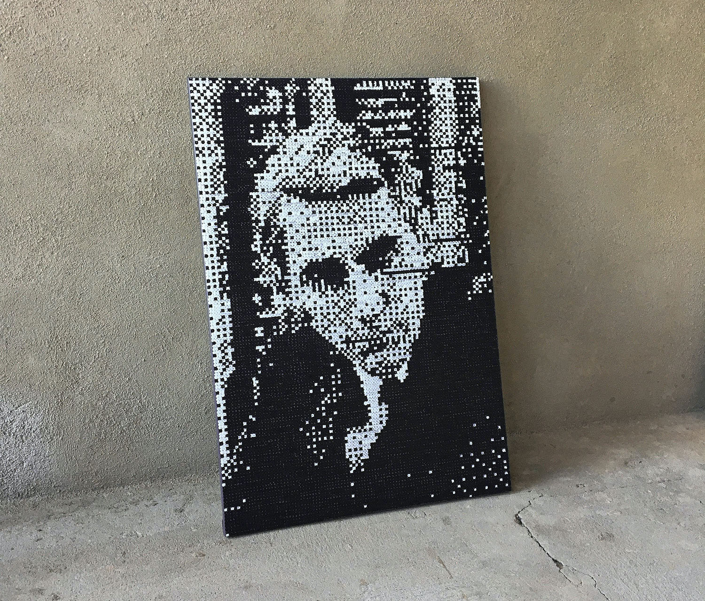

*italics*  
**bold**  
~~strikethrough~~  
`code`

> quote blocks (grey)

# Header h1 Header h1 Header h1 Header h1 Header h1 Header h1 Header h1 Header h1 Header h1 Header h1
## Header h2 Header h2 Header h2 Header h2 Header h2 Header h2 Header h2 Header h2 Header h2 Header h2
### Header h3 Header h3 Header h3 Header h3 Header h3 Header h3 Header h3 Header h3 Header h3 Header h3
#### Header h4 Header h4 Header h4 Header h4 Header h4 Header h4 Header h4 Header h4 Header h4 Header h4 
##### Header h5 Header h5 Header h5 Header h5 Header h5 Header h5 Header h5 Header h5 Header h5 Header h5 (same as h4 but without padding-bottom)
###### Header h6 Header h6 Header h6 Header h6 Header h6 Header h6 Header h6 Header h6 Header h6 Header h6 (style unassigned)

- List element A
  - List element A1
  - List element A2
  - List element A3
- List element B
- List element C

1.    List element
2. List element
3. List element

---

| Table | Syntax | Test |
| :--- | :---: | ---: |
| Align left | Align center | Align right |
|  |  |  |

```js
// Here's a bit of JavaScript:
console.log('hello!')
```

```rb
# And now some Ruby
def foo(bar)
  "baz"
end
```

```sh
$ cat /dev/urandom | grep "the answer to life" # shell scripts look nice too
```